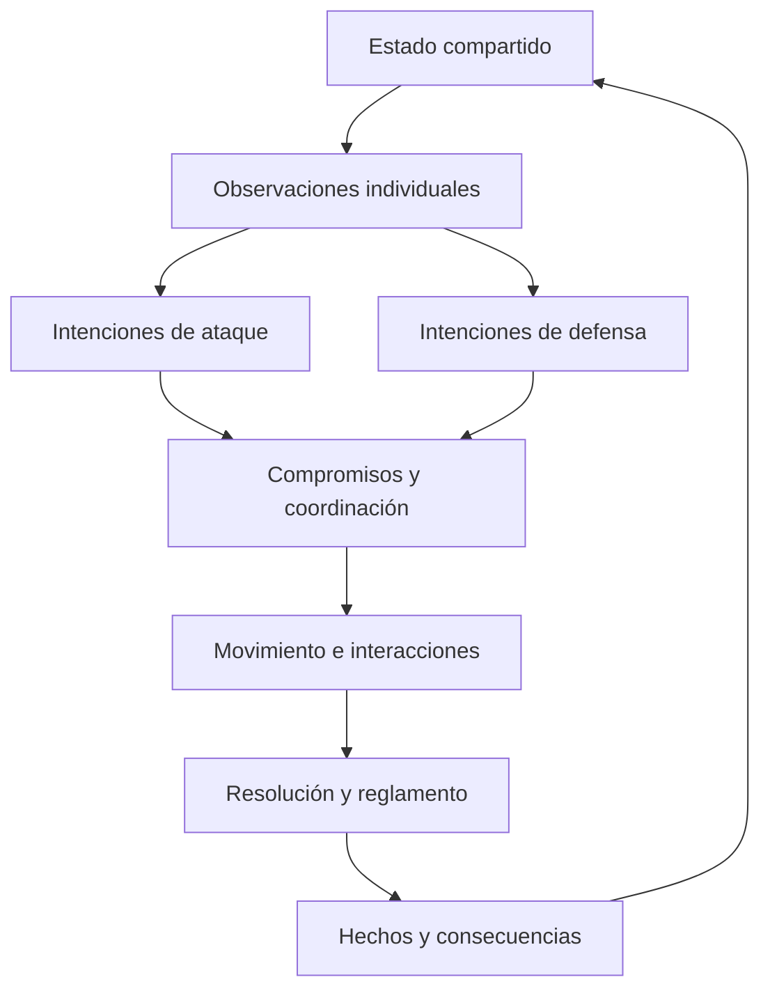
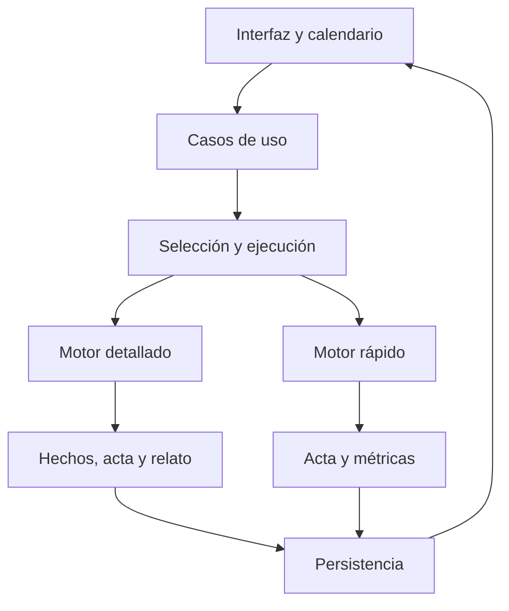

# BeManager — Del estudio al motor de partidos

**Documento:** MAT-PROP-001 · **Versión:** 1.1 · **Fecha:** 26 de septiembre de 2026  
**Estado:** DRAFT — propuesta para revisar juntos, con la decisión de dos modos de simulación incorporada.  
**Propósito:** recomendar cómo representar, ejecutar y comprobar un partido de baloncesto profundo, comprensible y viable para un juego de gestión.  
**No constituye:** una implementación, una aprobación de fórmulas ni un prompt ejecutable para Claude Code. Los ejemplos, prioridades y parámetros propuestos todavía deben convertirse en decisiones aprobadas.

**Base de trabajo:** el estudio `BeManager-estudio-baloncesto-v1.md`, el documento histórico `DESIGN(1).md`, las instrucciones históricas `CLAUDE.odt` y la Foundation `FND-001`. Se han consultado además fuentes primarias sobre otros motores y sobre simulación. Las referencias y sus límites están en el apartado 20.

## Índice y rutas de lectura

- [1. Recomendación](#1-recomendación)
- [2. Qué aprender de otros motores](#2-qué-aprender-de-otros-motores)
- [3. El contrato de realismo](#3-el-contrato-de-realismo)
- [4. Representar el partido](#4-representar-el-partido)
- [5. Tiempo, movimiento y simultaneidad](#5-tiempo-movimiento-y-simultaneidad)
- [6. Cómo deciden y se coordinan los diez jugadores](#6-cómo-deciden-y-se-coordinan-los-diez-jugadores)
- [7. Tácticas que cambian lo que sucede](#7-tácticas-que-cambian-lo-que-sucede)
- [8. Capacidades, tendencias y estados](#8-capacidades-tendencias-y-estados)
- [9. Resolver acciones sin perder coherencia](#9-resolver-acciones-sin-perder-coherencia)
- [10. Una posesión completa con diez protagonistas](#10-una-posesión-completa-con-diez-protagonistas)
- [11. Control del entrenador y adaptación rival](#11-control-del-entrenador-y-adaptación-rival)
- [12. Un partido vivo en texto](#12-un-partido-vivo-en-texto)
- [13. Arquitectura técnica](#13-arquitectura-técnica)
- [14. Partido detallado y simulación rápida](#14-partido-detallado-y-simulación-rápida)
- [15. Reglas, países y poblaciones](#15-reglas-países-y-poblaciones)
- [16. Cómo demostrar que funciona](#16-cómo-demostrar-que-funciona)
- [17. Qué construir y en qué orden](#17-qué-construir-y-en-qué-orden)
- [18. Decisiones preparadas para nuestra revisión](#18-decisiones-preparadas-para-nuestra-revisión)
- [19. Documentación y traslado a Claude Code](#19-documentación-y-traslado-a-claude-code)
- [20. Fuentes y alcance de la comparación](#20-fuentes-y-alcance-de-la-comparación)

| Lo que quieres revisar | Apartados prioritarios |
|---|---|
| Entender qué motor recomiendo | 1, 3, 10 y 17 |
| Discutir baloncesto, tácticas y atributos | 4, 6–11 y 16.4 |
| Revisar viabilidad técnica y rendimiento | 5, 13–15 |
| Preparar la primera entrega | 16–19 |
| Comprobar las referencias externas | 2 y 20 |

Este archivo reúne la propuesta para poder leerla y comentarla. No debe convertirse en la lectura obligatoria completa de cada tarea del repositorio. El apartado 19 explica cómo extraer documentos activos pequeños, con una única fuente de verdad.

## 1. Recomendación

**Recomiendo un motor híbrido de baloncesto con geometría 2D simplificada, diez jugadores con decisiones propias y coordinación colectiva, acciones que consumen tiempo y un registro de hechos del que salen estadísticas y narración.**

La unidad de interés será la **interacción**, dentro de una posesión que conserva memoria. Por ejemplo: bloqueo, persecución, contención, ayuda, pase, rotación y recepción. La posesión sirve para agrupar y medir; no obliga a decidir de una vez todo su desenlace.

La táctica determina qué intentan crear o impedir los jugadores. Las capacidades determinan qué perciben, cuánto tardan y con qué calidad ejecutan. La posición de los diez, el balón y los relojes determinan qué oportunidades existen. El resultado aparece al resolver esas interacciones.

El diferencial que buscaría es **poder reconocer, intervenir y aprender**:

1. Reconocer que el rival está castigando una concesión concreta.
2. Cambiar una instrucción que modifica responsabilidades y decisiones.
3. Observar que aparecen otras ventajas, costes y respuestas.
4. Entender por qué el ajuste puede ser bueno aunque el siguiente lanzamiento entre o falle.

Eso exige que el juego registre el trabajo de quien bloquea, arrastra una ayuda, ocupa una esquina, comunica un cambio o cierra para que rebotee otro. La profundidad debe existir antes de escribir la crónica.

### 1.1 Qué significa «híbrido»

| Componente | Representación recomendada | Qué aporta |
|---|---|---|
| Desplazamiento | Posición, velocidad, orientación y trayectorias simples en 2D | Distancias, ángulos, espacio, llegada y recuperación |
| Decisiones | Opciones locales limitadas, roles y lecturas | Jugadores diferentes y juego colectivo |
| Acciones | Inicio, ejecución, compromiso, interrupción y final | Un pase o un bloqueo necesita tiempo y puede frustrarse |
| Sucesos | Recepción, contacto, tiro, rebote, falta, bocina… | Orden y consecuencias verificables |
| Incertidumbre | Ejecución y percepción condicionadas al contexto | Variabilidad plausible, sin decidir previamente el marcador |
| Reglamento | Estado y transiciones tipadas por edición | Legalidad y reanudaciones consistentes |
| Presentación | Proyecciones del registro de hechos | Texto, acta, análisis y futura representación visual |

No hace falta reproducir cada articulación, bote o giro del balón. Sí hace falta conservar las diferencias que cambian una decisión de baloncesto. El criterio para añadir detalle será: **¿permite distinguir dos situaciones que deberían tener consecuencias distintas y podemos comprobarlo?**

### 1.2 Dos modos de partido con un diseño deportivo común

**Decisión acordada:** tu partido utiliza el motor detallado. También puedes elegir antes de que empiecen otros partidos rivales para seguirlos en detalle, con relato. Los demás se calculan con un motor rápido. Tendrán boxscore y estadísticas detalladas de jugadores y equipos, incluidos datos útiles para ojear tácticas, sin relato ni texto jugada a jugada. Un partido ya resuelto en modo rápido no puede convertirse después en un encuentro narrado.

El laboratorio y los partidos elegidos comparten el motor detallado. El rápido es una aproximación distinta: utiliza los mismos perfiles de jugadores, planes tácticos, conceptos de acción y reglamentos, pero calcula resultados y estadísticas sin resolver cada movimiento de los diez jugadores. Su coherencia con el detallado debe medirse por contextos y distribuciones; no se promete identidad jugada a jugada.

La modularidad técnica sigue siendo necesaria. Movimiento, decisiones, reglas y estadísticas pueden estar en archivos separados. Tácticas y atributos intervienen en ambos modos mediante contratos compartidos, con resolución propia en cada uno. Ese es el cambio respecto a construir primero resultados y colocar tácticas encima.

### 1.3 Qué podemos prometer y qué debemos demostrar

Esta es una recomendación de arquitectura, no una demostración de que ya sea más realista que cualquier juego existente. La comparación pública no permite auditar los motores propietarios, y BeManager aún no tiene un prototipo medido de este modelo.

Sí podemos definir desde ahora qué tendría que demostrar: juego sin balón efectivo, ajustes tácticos con mecanismos visibles, coherencia reglamentaria, distribuciones plausibles y rendimiento suficiente. La primera inversión debe ir a un laboratorio que permita comprobar esas cinco cosas.

## 2. Qué aprender de otros motores

### 2.1 Comparación y límites

| Referencia | Evidencia consultada | Qué aporta a la propuesta | Límite de la comparación |
|---|---|---|---|
| Proyecto anterior | Diseño y convenciones aportados | Posesiones, jugadores en pista y separación de configuración | Se audita el diseño escrito, no su código ni su rendimiento |
| Basketball GM / ZenGM | Archivo público `GameSim.basketball/index.ts` | Ejemplo inspeccionable de resolución por posesiones, acta y relato | La lectura realizada es selectiva; no constituye auditoría completa del repositorio |
| Football Manager 2024 | Explicación oficial de roles y juego posicional | Pensar en movimientos que se ajustan a los compañeros | Describe comportamiento; no revela el algoritmo interno |
| NBA 2K26 y 2K27 | Comunicados oficiales de jugabilidad | Referencias sobre lecturas ofensivas y coordinación | Son anuncios del desarrollador, no validaciones independientes |
| Modelos científicos de posesión y defensa | Trabajos de Cervone y de Franks y colaboradores | El espacio y las interacciones contienen información que el acta pierde | Un modelo predictivo observacional no entrega automáticamente un motor causal |

Las conclusiones de implementación que siguen son propias; no se atribuyen a los autores de esas referencias.

### 2.2 Basketball GM: aprender de un motor accesible

En el código consultado, `simPossession()` actualiza valoraciones colectivas, obtiene un desenlace, gestiona continuidad tras ciertos resultados y actualiza tiempo de juego. Se observan llamadas al registro de eventos, sustituciones y sinergias. Es una referencia útil para estudiar un simulador de gestión organizado alrededor de posesiones. [S01](#s01-basketball-gm)

**Aplicación a BeManager:** conservar una ejecución independiente de la pantalla y eventos estructurados. Nuestro requisito adicional es representar explícitamente la geometría y las responsabilidades que producen una oportunidad. No basta con añadir más desenlaces al catálogo si sus causas siguen sin existir en el estado.

No se ha medido aquí la velocidad de Basketball GM ni se afirma que todas sus decisiones internas se reduzcan a un único sorteo. Tampoco se propone copiar su implementación o sus coeficientes.

### 2.3 Football Manager: los roles deben relacionarse

La explicación oficial de FM24 describe mejoras en movimientos sin balón y rotaciones posicionales; incluye roles cuyo comportamiento cambia entre ataque y defensa. Esto aporta una referencia de producto: una instrucción debe cambiar relaciones espaciales reconocibles. [S02](#s02-football-manager)

**Aplicación a BeManager:** cuando uno corta, otro puede ocupar el espacio liberado; cuando un defensor ayuda, otro puede asumir su responsabilidad. No extrapolamos ritmos, distancias ni el algoritmo del fútbol al baloncesto.

### 2.4 NBA 2K: lecturas y coordinación, con otro presupuesto

2K26 anuncia lecturas de penetración y pase para crear fuera de jugadas prefijadas, junto con cambios en ayudas dobles. 2K27 presenta coordinación de acciones alrededor de facilitadores y ajustes colectivos de emparejamientos. [S03](#s03-nba-2k26), [S04](#s04-nba-2k27)

**Aplicación a BeManager:** organizar oportunidades mediante responsabilidades compartidas y respuestas al rival. La propuesta no necesita capturas de movimiento ni el control manual de cada gesto para representar esos mecanismos. No inferimos de estos anuncios cómo se simulan las temporadas ni que se use el mismo algoritmo en todos sus modos.

### 2.5 Ciencia espacial: una guía para elegir qué representar

El modelo de Cervone y colaboradores combina movimiento e interacciones discretas para estimar el valor esperado de una posesión. El trabajo de Franks y colaboradores estudia estructura espacial de la defensa. Son apoyo para considerar el estado espacial y la influencia defensiva más allá del resultado del tiro. [S05](#s05-valor-de-posesión), [S06](#s06-estructura-espacial-de-la-defensa)

**Aplicación a BeManager:** medir oportunidades y restricciones antes del desenlace. No presentar nuestro valor esperado como un EPV validado por esos artículos, ni importar coeficientes sin sus datos y condiciones.

### 2.6 La elección entre familias de motor

| Familia | Ventaja principal | Dificultad para nuestro objetivo | Valoración propia |
|---|---|---|---|
| Resultado global o posesión agregada | Bajo coste y calibración inicial sencilla | Poco soporte para explicar ayudas y continuidad | Insuficiente como núcleo diferencial |
| Eventos con zonas discretas | Comprensible y económico | Ángulos y ventanas se vuelven etiquetas arbitrarias con facilidad | Útil como categorización, limitada como espacio único |
| Diez agentes con física detallada y decisiones frecuentes | Mucha expresividad potencial | Coste de desarrollo, calibración y ejecución elevado | Excesivo para empezar |
| Generación aprendida de secuencias | Puede imitar patrones de datos | Datos, control táctico, legalidad y comportamiento fuera de muestra | Posible herramienta futura, no dependencia inicial |
| Geometría simple, coordinación y eventos | Conserva causas con coste acotable | Requiere buenos contratos temporales y validación | **Recomendación para BeManager** |

## 3. El contrato de realismo

### 3.1 Cinco requisitos que deben cumplirse juntos

| Requisito | Qué significa | Ejemplo de fallo |
|---|---|---|
| Causal | Las consecuencias dependen de acciones y contexto | La esquina aparece libre sin que nadie haya abandonado su marca |
| Reglamentario | Balón, relojes, faltas y reanudaciones son compatibles | Rebote ofensivo tratado siempre como posesión nueva |
| Estadístico | Frecuencias y distribuciones plausibles para una población definida | Marcadores correctos con casi todos los ataques terminando igual |
| Táctico | Las políticas cambian oportunidades, concesiones y respuestas | Cambiar cobertura solo modifica un porcentaje de acierto |
| Jugable | El entrenador puede observar, decidir y comprobar | Profundidad interna que la interfaz no permite entender |

La calidad estadística no compensa una causalidad incoherente. La complejidad geométrica tampoco compensa una experiencia en la que el usuario no entiende qué ha cambiado.

### 3.2 La ventaja como relación, no como barra universal

Conviene describir una ventaja con varias magnitudes: distancia ganada, tiempo hasta la recuperación, superioridad local, trayectoria disponible, emparejamiento y opciones de pase. No recomiendo un único `advantage = 73` que luego se transforme en todos los resultados.

Ejemplo: superar al defensor del balón no garantiza una bandeja. Puede quedar un protector colocado, un pasador incapaz de castigar la ayuda y dos atacantes ocupando el mismo carril. El motor debe conservar esas diferencias.

Tampoco todos tienen que desplazarse continuamente. Mantener una esquina puede ser la mejor acción. La exigencia es que **los diez estén representados y sus responsabilidades puedan tener consecuencias**, no forzar diez animaciones ni diez menciones por posesión.

### 3.3 Límites deliberados de la primera arquitectura

- Cancha y desplazamientos 2D; altura del balón y alcance representados cuando una interacción los necesita.
- Repertorio finito y ampliable de acciones y lecturas, sin búsqueda de todas las jugadas futuras.
- Capacidades funcionales antes que un catálogo enorme de atributos visibles.
- Error contextual en percepción y ejecución; sin correcciones secretas para cerrar el marcador.
- Narración construida a partir de hechos; sin un modelo de lenguaje decidiendo el partido.
- Reglas implementadas por alcance declarado; un perfil incompleto no se presenta como una competición completa.

## 4. Representar el partido

### 4.1 Estado mínimo con capacidad de crecer

| Entidad | Información necesaria | Motivo |
|---|---|---|
| Partido | Período, puntos, relojes, estado reglamentario, posesión estadística | Orden y contexto de la secuencia |
| Cancha | Dimensiones, líneas, canastas, zonas derivadas, dirección de ataque | Geometría dependiente del reglamento |
| Balón | Estado, control, trayectoria, último toque y eventos relevantes | Distinguir pase, lanzamiento, disputa y balón muerto |
| Jugador en pista | Posición, velocidad, orientación, acción y equilibrio | Saber qué puede hacer ahora |
| Perfil del jugador | Capacidades, dimensiones, repertorio y tendencias | Diferencias persistentes |
| Estado del jugador | Fatiga, faltas, atención cuando se modele, restricciones | Consecuencias acumuladas |
| Equipo | Plan vigente, roles, emparejamientos, ayudas y balance | Coordinación ofensiva y defensiva |
| Conocimiento | Observaciones recientes, avisos y scouting disponible | Evitar decisiones omniscientes |
| Acciones pendientes | Participantes, fases, objetivos y tiempos | Concurrencia e interrupciones |
| Administración | Sanciones pendientes, libres, saques, sustituciones, tiempos muertos | Continuidad legal entre acciones |

Separar identificadores de **posesión estadística**, **fase ofensiva**, **acción colectiva** y **evento**. Un rebote ofensivo puede iniciar otra fase dentro de la misma posesión. El control reglamentario del equipo es otro concepto y se administra según el perfil de reglas.

### 4.2 Geometría suficiente

Usaría coordenadas en unidades de cancha y zonas calculadas desde ellas. «Esquina», «codo» o «lado débil» ayudan a las tácticas y al texto; no sustituyen la posición.

Para cada interacción importante interesa conocer:

- Distancia y orientación respecto al balón, objetivo y canasta.
- Velocidad actual y capacidad de acelerar, frenar o cambiar de dirección.
- Camino accesible y obstáculos próximos.
- Tiempo de llegada estimado de cada participante.
- Alcance útil en esa postura y acción.
- Responsabilidad que se abandona para intervenir.

No hace falta una malla compleja de navegación para diez jugadores en una cancha pequeña. Empezaría con trayectorias cortas, evitación local de ocupación y tratamiento específico de pantallas/contactos. Hay que impedir atravesar bloqueadores o rivales relevantes, aunque no se use un motor de cuerpos rígidos.

**Límite importante:** dos coordenadas no demuestran pasos o doble regate. Para esas acciones también hacen falta estados simbólicos: bote vivo, recogida, apoyos cuando el modelo los contemple, pie de pivote y fase de lanzamiento. La geometría no sustituye al reglamento.

### 4.3 Conservar continuidad

Tras una recepción, no se recoloca automáticamente a los diez en sus posiciones ideales. Tras un rebote, tampoco se reinicia la defensa perfectamente organizada. Esas posiciones heredadas explican transición, desajustes y segundas oportunidades.

Las formaciones son objetivos de organización y puntos de referencia. Cada jugador necesita tiempo para llegar, puede ver el camino bloqueado y debe adaptarse al balón. «Volver al sistema» también es una acción del partido.

## 5. Tiempo, movimiento y simultaneidad

### 5.1 Tres relojes distintos

| Tiempo | Uso | Ejemplo |
|---|---|---|
| Tiempo interno de simulación | Ordenar movimientos, reacción, vuelo y recuperación | Un pase tarda en llegar incluso si una señal detiene el reloj oficial |
| Relojes reglamentarios | Período, lanzamiento y otros conteos | Pueden detenerse o reiniciarse por una regla |
| Tiempo de presentación | Ritmo al que el usuario ve los hechos | Pausa, velocidad rápida, lectura paso a paso |

Los descansos y tiempos muertos tienen una duración virtual definida para recuperación. No se calculan según lo que Dennis tarde en leer una pantalla. Pausar la interfaz durante cinco minutos no recupera físicamente al equipo.

### 5.2 Recomendación temporal concreta

Propongo un avance espacial con **paso máximo acotado**, combinado con fronteras de evento que pueden caer dentro de ese paso. Como hipótesis inicial de prototipo se puede probar un máximo de **100 ms**, usando tiempos internos enteros, por ejemplo milisegundos. Son convenciones técnicas por evaluar, no frecuencias humanas demostradas.

El siguiente avance se corta en el primero de estos límites: paso espacial máximo, evento programado, oportunidad de decisión o frontera reglamentaria. Si un pase llega dentro de 43 ms, se resuelve ahí; no al final de un bloque de 100 ms. Las intersecciones relevantes se comprueban a lo largo del trayecto, para evitar que un balón rápido atraviese una zona interceptable sin detección.

No todos deciden cada 100 ms. Una trayectoria ya comprometida puede continuar; una observación nueva puede habilitar una reacción tras su latencia. El tiempo de percepción pertenece al jugador; el tamaño de paso pertenece al simulador.

Separar avance y presentación evita que el resultado dependa de los fotogramas de la interfaz. La literatura técnica sobre integración temporal explica ese riesgo; la elección concreta para BeManager deberá comprobarse en el prototipo. [S07](#s07-tiempo-de-simulación)

### 5.3 Un ciclo que no favorezca al jugador evaluado primero

1. Consolidar el estado correspondiente al instante actual y sus hechos ya resueltos.
2. Construir las observaciones que legítimamente tiene cada jugador elegible para decidir.
3. Proponer intenciones usando esa misma frontera temporal. Ninguno lee la decisión recién calculada del rival.
4. Resolver coordinación y compromisos compatibles dentro de cada equipo.
5. Avanzar movimientos y balón hasta la siguiente frontera.
6. Detectar interacciones, resolver ejecución y adjudicar sus consecuencias.
7. Registrar hechos, actualizar estados y habilitar reacciones posteriores.



Es una estructura conceptual, no siete servicios. El contacto, la liberación del balón y la bocina pueden exigir subdividir una ejecución.

### 5.4 Acciones con compromiso

Cada acción declara cuándo puede empezar, qué necesita, qué recursos ocupa, cuánto tarda, qué puede interrumpirla y qué continuación admite.

| Acción | Compromiso que debe existir | Interrupción o coste posible |
|---|---|---|
| Preparar un tiro | Orientar, reunir balón y completar preparación | Closeout, mala recepción, cambio de decisión antes de liberar |
| Pasar | Preparar y liberar hacia una ventana | Ventana cerrada antes de soltar, pase desviado, recepción tardía |
| Bloquear | Llegar, adoptar posición y orientar pantalla | Defensor evita contacto, atacante usa mal el ángulo, falta |
| Ayudar | Abandonar posición y recorrer distancia | Pase hacia el jugador liberado, recuperación demasiado larga |
| Cerrar rebote | Ganar y mantener una posición legal | Perder acceso a otro balón o quedar retrasado para correr |

Cambiar de intención no borra la inercia ni devuelve el tiempo consumido. Una ventana mínima de compromiso y un criterio de mejora para cambiar de opción evitan que el jugador oscile entre dos decisiones en cada actualización.

### 5.5 Sucesos simultáneos y progreso

El orden de resolución debe apoyarse primero en tiempos y reglas. Cuando dos sucesos son inseparables a la resolución elegida, se resuelven como una interacción conjunta o con un criterio documentado. No debe favorecer por defecto al local, al atacante o al identificador menor.

Una protección contra bucles puede detener un escenario y exportar el diagnóstico. No debe «arreglarlo» concediendo una canasta, reiniciando el reloj o inventando una pérdida. Cada transición de tiempo cero debe reducir trabajo pendiente o avanzar a otro estado; los ciclos inválidos son errores visibles.

### 5.6 El error de sortear una falta en cada actualización

Si se aplica una probabilidad fija cada paso, cambiar la frecuencia del motor cambia el número de faltas. Para sucesos modelados mediante una tasa temporal, una forma coherente es `p = 1 − exp(−λ·Δt)`, con unidades declaradas y supuestos explícitos. Con varios riesgos que compiten, hay que tratar su competencia, no activarlos independientemente.

No todos los sucesos necesitan una tasa. Un contacto identificado puede resolverse una vez con una probabilidad condicionada a sus características. La ejecución sorteada para una acción se conserva durante su trayectoria; no se vuelve a sortear cada vez que se dibuja o inspecciona.

### 5.7 Comprobar la resolución elegida

Antes de fijar el paso máximo, ejecutaría los mismos escenarios con resoluciones candidatas, por ejemplo 50, 100 y 200 ms, conservando las reglas de reacción y las tasas temporales. Compararía tiempos de llegada, ventanas, contactos detectados y distribuciones de desenlace. Los casos de liberación/bocina se comprueban además con tiempos exactos conocidos.

No se espera igualdad bit a bit entre resoluciones diferentes. Se busca que aumentar precisión no cambie sustancialmente el comportamiento que creemos estar representando y que las trayectorias relevantes no atraviesen interacciones sin detectarlas. Una vez elegida, la misma política temporal se utiliza en el laboratorio y en los partidos detallados; el motor rápido tiene su propio avance agregado.

## 6. Cómo deciden y se coordinan los diez jugadores

### 6.1 Una jerarquía pequeña

| Nivel | Pregunta que resuelve | Ejemplo |
|---|---|---|
| Plan del entrenador | ¿Qué queremos priorizar y conceder? | Proteger aro, perseguir tiradores, atacar un emparejamiento |
| Organización colectiva | ¿Quién hace qué en esta fase? | Manejador, bloqueador, salida, ocupación del lado débil, balance |
| Lectura local | ¿Qué oportunidad veo ahora? | Continuar, pasar, tirar, cortar, contener, recuperar |
| Ejecución | ¿Cómo realizo la acción elegida? | Trayectoria, ritmo, ángulo, preparación y calidad del pase |

La organización colectiva no conoce el futuro ni dirige a cinco marionetas perfectamente sincronizadas. Proporciona acuerdos. Cada participante percibe, llega y ejecuta con sus capacidades.

### 6.2 Opciones limitadas y valor estimado

Cada jugador evalúa un conjunto pequeño de opciones relevantes para su rol y el estado. El manejador no explora millones de continuaciones; puede valorar pasar a receptores accesibles, atacar un carril, tirar, esperar o reiniciar. Un jugador sin balón evalúa mantener, recolocarse, cortar, bloquear, ofrecer salida o prepararse para rebote/balance.

La preferencia puede representarse conceptualmente como:

`valor estimado = beneficio previsto − riesgo − coste temporal − coste de esfuerzo + afinidad con el plan`

No son pesos aprobados ni una promesa de valoración perfecta en puntos. Primero pueden utilizarse reglas y utilidades simples, calibradas por familia. Las probabilidades imposibles se excluyen antes de puntuar opciones; un bonus de plan no habilita un pase físicamente inaccesible.

La inteligencia deportiva tiene al menos tres lugares diferentes: detectar una opción, estimarla y elegir a tiempo. No debe convertirse en un multiplicador de acierto añadido al final.

### 6.3 Información parcial con incertidumbre acotada

El motor conoce el estado verdadero. Los jugadores utilizan una vista limitada por atención, orientación, observaciones recientes, anticipación y comunicación. Esto no exige simular un sistema visual humano completo.

Empezaría con hechos observados y caducidad: dónde vio al defensor, cuándo recibió el aviso, qué cobertura reconoce y cuánto tarda en reaccionar. El error debe poder explicarse por una observación tardía o una lectura, no por ocultar jugadores aleatoriamente sin contexto.

Las capacidades exactas del rival tampoco deben ser conocimiento omnisciente. El plan defensivo puede usar scouting y comportamiento observado. Un jugador ficticio desconocido no genera automáticamente una «gravedad» perfecta porque el simulador sepa su atributo interno.

### 6.4 Coordinación y asignaciones

Mantendría un registro de responsabilidades por equipo:

- Marca o área primaria.
- Primera ayuda y responsabilidad de recuperación.
- Protección del aro y control del continuador.
- Salida de pase y ocupación de espacios.
- Bloqueos/cortes coordinados y participantes.
- Carga de rebote y balance defensivo.

Una responsabilidad puede quedar temporalmente sin cubrir. Eso es parte del juego, no un error que deba resolverse mediante teletransporte. El registro permite explicar quién la asumió o por qué nadie llegó.

Para una tarea compartida se propone un participante y se coordina su aceptación según plan, comunicación y disponibilidad. Ese acuerdo puede llegar tarde. Si modelamos un fallo de comunicación, sus consecuencias deben verse en dos jugadores que esperan cosas diferentes; no en una penalización global de «química».

### 6.5 Ataque sin balón desde el primer corte

| Conducta | Qué modifica | Qué debe observar el motor |
|---|---|---|
| Mantener amplitud | Distancia que necesitará recorrer una ayuda | Defensor situado más lejos de una intervención |
| Reubicarse | Ángulo y ventana de pase | Línea accesible antes de la recuperación |
| Cortar detrás | Castiga vigilancia orientada al balón | Ventaja de llegada al espacio interior |
| Bloquear lejos del balón | Retrasa o cambia un emparejamiento | Trayectoria del defensor y liberación del receptor |
| Sellar | Impide una recuperación o facilita recepción | Contacto, posición y acceso al balón |
| Ofrecer salida | Permite salir de presión | Receptor alcanzable y continuidad disponible |
| Cargar o balancear | Cambia la siguiente fase | Candidatos al rebote y cobertura de transición |

### 6.6 Defensa sin balón desde el primer corte

| Conducta | Beneficio buscado | Concesión o riesgo |
|---|---|---|
| Negar recepción | Retrasar o impedir inicio de acción | Corte a la espalda |
| Mostrar ayuda y recuperar | Disuadir penetración sin abandonar del todo | Llegar tarde si se compromete demasiado |
| Ayudar al continuador | Evitar recepción cerca del aro | Liberar el lado débil |
| Rotar hacia el liberado | Reparar una ayuda | Desplazar el problema a otro atacante |
| Cambiar asignaciones | Evitar separación inmediata | Nuevo emparejamiento o comunicación fallida |
| Contener sin robar | Mantener estructura | Conceder algún espacio de tiro o avance |
| Cerrar al atacante | Reducir segunda oportunidad | Renunciar a salir antes al contraataque |

Una buena defensa puede producir una ventaja negativa para el ataque: pase que no intenta, recepción alejada o tiro forzado al final. Esos resultados deben aparecer en el análisis aunque no haya robo ni tapón.

## 7. Tácticas que cambian lo que sucede

### 7.1 Una gramática de acciones

Un sistema se compone de disposición inicial, roles, acciones, desencadenantes, lecturas y continuaciones. «Spain pick-and-roll» necesita representar un bloqueo sobre el defensor del continuador; no basta con reconocer su nombre y sumar eficiencia.

Ejemplo conceptual de una instrucción ofensiva, sin sintaxis de implementación aprobada:

```yaml
family: high_pick_and_roll
roles:
  handler: O1
  screener: O5
  weak_corner: O3
  weak_wing: O4
  strong_corner: O2
reads:
  - when: handler_advantage_detected
    prefer: attack_gap
  - when: roll_helper_commits
    prefer: weak_side_pass
  - when: two_defenders_commit_to_ball
    prefer: available_short_roll_or_outlet
fallback: preserve_control_and_reorganize
```

El ejemplo muestra intención y lecturas. No concede éxito: `roll_helper_commits` debe ser percibido; la línea puede cerrarse; el pasador puede no dominar el envío; la recepción consume tiempo. Los desencadenantes no pueden consultar estados futuros ni atributos secretos del rival.

### 7.2 Dónde debe actuar cada instrucción

| Instrucción | Cambio causal esperado | Coste o contrapartida que hay que modelar |
|---|---|---|
| Aumentar ritmo | Iniciar antes, correr, aceptar ciertas ventanas | Esfuerzo, coordinación incompleta, riesgo de pérdida |
| Asegurar posesión | Priorizar continuidad y líneas seguras | Tiempo y oportunidades rechazadas |
| Espaciar con cinco abiertos | Alejar referencias ofensivas del aro | Acceso al rebote y amenaza real de cada jugador |
| Atacar al defensor más débil | Buscar acciones que lo involucren | Tiempo de preparación y respuesta rival |
| Drop profundo | Interior protege una zona más próxima al aro | Espacio intermedio y tiros del manejador |
| Cambiar bloqueos | Transferir responsabilidades al contacto/acuerdo | Emparejamientos, sellos y rebote |
| Atrapar al manejador | Comprometer dos defensores al balón | Receptor liberado y rotaciones posteriores |
| Pasar por debajo | Reducir recorrido para contener penetración | Ventana de lanzamiento si el ataque la usa |
| Negar centro | Orientar la conducción a otro carril | Ayudas coherentes con esa orientación |
| Ayudar desde un perfil concreto | Elegir qué recepción conceder | Riesgo de que ese jugador o su continuación castigue |
| No abandonar esquina | Mantener responsabilidad exterior | Mayor carga para contener balón y roll |
| Presionar líneas | Acortar ventanas y negar recepción | Cortes, faltas, fatiga y ayudas largas |
| Cargar rebote | Enviar jugadores hacia zonas de disputa | Menor cobertura inicial de transición |
| Proteger balance | Asignar retorno temprano | Menos participantes en segunda oportunidad |

La tabla expresa mecanismos esperados, no leyes universales de victoria. Un mayor ritmo también puede generar tiros excelentes si la defensa no está organizada.

### 7.3 Estilo, acción y emergencia son niveles distintos

- **Estilo:** prioridades repetidas, como correr, circular rápido o atacar interior.
- **Acción:** coordinación concreta, como mano a mano, bloqueo directo o corte.
- **Lectura:** respuesta local, como pasar ante ayuda o rechazar un bloqueo.
- **Emergencia:** resolver reloj corto, presión inesperada o acción rota.

No conviene que «ataque de movimiento» sea otra acción al mismo nivel que un pase. Tampoco que un sistema completo sea una secuencia obligatoria que continúa aunque la defensa la haya desbaratado.

### 7.4 Orden entre instrucciones y contradicciones

Propongo esta prioridad conceptual: legalidad y factibilidad → emergencia de reloj/seguridad → instrucción específica vigente → regla de la acción → principio de equipo → tendencia individual.

El orden exacto deberá aprobarse, especialmente cuánto puede improvisar un jugador. Una regla específica como «no ayudar desde esta esquina» debe tener un comportamiento definido cuando el aro queda libre; Claude Code no debe decidir ese sacrificio por su cuenta.

La configuración detectará contradicciones evidentes: asignar dos tareas simultáneas incompatibles al mismo jugador, pedir que cinco carguen y que tres de esos mismos cinco hagan balance inmediato, o elegir una acción cuyo rol no está cubierto. Algunas combinaciones arriesgadas deben ser permitidas y explicadas, no corregidas secretamente.

### 7.5 Cómo ampliar el repertorio

| Familia futura | Primitivas y responsabilidades que aprovecha |
|---|---|
| Mano a mano | Entrega/recepción, protección, pantalla y lectura defensiva |
| Salidas indirectas | Trayectoria, pantalla, persecución, curl, fade y corte |
| Poste | Entrada, sello, orientación, ayuda y pase de salida |
| Spain, ram y variantes | Encadenar acciones y sincronizar participantes |
| Zonas defensivas | Responsabilidad espacial, traspaso de marcas, ayuda y rebote |
| Presiones | Trampas, salidas, rotaciones y avance del balón |
| Saques especiales | Posiciones legales, bloqueos, ventanas y reloj de administración |

La arquitectura debe permitirlas, pero no obliga a implementarlas todas en la primera entrega. Una táctica nueva debe declarar qué reutiliza y qué interacción nueva exige.

## 8. Capacidades, tendencias y estados

### 8.1 Llevar los atributos al lugar donde producen diferencias

El inventario de 43 capacidades del estudio sirve como mapa. No recomiendo convertirlo automáticamente en 43 números visibles. Antes hay que demostrar qué dimensiones distinguimos de verdad.

| Familia funcional | Lugar de intervención | Diferencia observable | Precaución |
|---|---|---|---|
| Lectura y exploración | Generación de opciones percibidas | Detecta o pierde la ayuda y su salida | No añadir después un bonus general de acierto |
| Decisión | Comparación de opciones conocidas | Elige una continuación razonable para el contexto | No consultar qué opción habría acabado entrando |
| Anticipación y timing | Preparación y reacción | Interviene antes de que cierre la ventana | No leer intenciones futuras con certeza |
| Comprensión espacial | Ubicación objetivo | Conserva carriles y ángulos de pase | No otorgar separación gratuita |
| Comunicación y disciplina | Coordinación | Cambio avisado, ayuda y recuperación compatibles | Sin multiplicador universal de química |
| Manejo | Control durante desplazamiento/presión | Protege balón, conserva bote, supera exposición | Diferenciar volumen de intentos y seguridad |
| Pase | Preparación, trayectoria y precisión | Balón al lugar y momento adecuados | Diferenciar ver, decidir y ejecutar |
| Recepción | Control y preparación posterior | Recibe listo o pierde tiempo ajustando | No cobrar dos veces ese retraso |
| Bloqueo | Posición, ángulo y contacto legal | Retrasa una ruta defensiva concreta | Sin bonus de tiro por el nombre del bloqueador |
| Desmarque | Trayectoria y uso de pantalla | Recibe con ventaja o permite recuperación | No equivale a velocidad máxima |
| Tiro | Ejecución según distancia y tipo | Diferentes probabilidades bajo igual contexto | Separar recepción, bote y preparación cuando aporte valor |
| Finalización | Ejecución cerca del aro | Resuelve ángulo, alcance y contacto | Evitar sumar capacidades que describen lo mismo |
| Tiro libre | Ejecución de la acción específica | Conversión de libres | No depende de una defensa inexistente |
| Contención | Distancia y orientación defensiva | Conduce el balón a la concesión prevista | No se agota en un rating global de defensa |
| Navegación | Ruta alrededor de una pantalla | Recupera antes o queda detrás | No sustituirla por velocidad punta |
| Contestación | Trayectoria, alcance y timing | Interfiere legalmente o se precipita | Un defensor lejano no resta acierto por reputación |
| Robo/intercepción | Intervención sobre balón accesible | Desvío, captura, fallo o falta | Distinguir intento, toque y control |
| Cierre de rebote | Posición y contacto | Impide acceso aunque otro capture | No atribuir todo al reboteador final |
| Captura y palmeo | Resolución del balón disputado | Control, segundo salto, desvío útil | Incluir elegibilidad espacial |
| Movimiento físico | Acelerar, frenar, girar y desplazarse | Tiempo de llegada y equilibrio | No penalizar otra vez por altura el efecto ya representado |
| Fuerza, salto y alcance | Contacto y espacio alcanzable | Sello, verticalidad y disputa | Separar dimensiones corporales y técnica |
| Resistencia y recuperación | Evolución de recursos | Mantiene o recupera ejecución tras esfuerzos | No usar solo minutos como carga |

Estas familias son contratos de mecanismo. Su agrupación en atributos de la ficha, escalas y correlaciones sigue abierta.

### 8.2 Capacidad no es intención

Un jugador puede tener buena precisión de pase y arriesgar demasiado. Otro puede tener buen tiro y rechazar ventanas por preferencia o plan. Un gran saltador puede no cargar el rebote porque tiene asignado balance.

Por eso separaría:

- **Capacidad:** lo que puede ejecutar.
- **Tendencia:** lo que suele intentar bajo ciertas condiciones.
- **Rol e instrucción:** lo que se le pide en esta fase.
- **Estado:** lo que puede ejecutar ahora, dadas carga y posición.
- **Familiaridad:** qué acuerdos conoce y coordina.

### 8.3 Fatiga con una vía causal acotada

Empezaría con fatiga física y recuperación, registrando carga por actividad: acelerar, sostener desplazamiento intenso, saltar, disputar y recuperarse. La misma acción simultánea no se cobra varias veces porque tenga varias etiquetas.

La fatiga puede modificar capacidades efectivas y tiempos de ejecución. Hay que elegir y medir esas vías antes de añadir una penalización final de acierto: si ya produjo una mala parada, reducir otra vez el tiro por el mismo motivo duplicaría el efecto.

No incluiría de inicio una «racha» que aumente automáticamente el acierto tras canastas, una moral omnipresente o un atributo de consistencia que simplemente sortee ruido independiente en cada lanzamiento. El estudio ya explica por qué esos atajos necesitan una justificación diferente.

### 8.4 Una regla para aceptar un atributo

Una dimensión entra en el núcleo cuando podemos completar esta frase: **«Al variar solo esta capacidad, cambia este mecanismo y podemos observarlo con este escenario»**.

Si únicamente cambia el marcador agregado, todavía no sabemos si representa algo distinto. Si dos atributos siempre producen exactamente el mismo efecto, debemos agruparlos o redefinirlos antes de aumentar el catálogo.

## 9. Resolver acciones sin perder coherencia

### 9.1 El contexto se construye antes del resultado

Para resolver un pase necesitamos emisor, receptor previsto, línea, tiempos, defensores que pueden intervenir y estado técnico. Para un tiro necesitamos posición, tipo, preparación, equilibrio y contestación posible. No basta con «atacante contra su defensor nominal».

La forma conceptual es:

`resultado y duración ~ P(· | estado, acciones concurrentes, capacidades, reglas)`

El objetivo no es eliminar el azar. Es situarlo en interacciones comprensibles y evitar resultados incompatibles.

### 9.2 Ventanas temporales

Una recepción exterior puede evaluarse con tiempos referidos al mismo origen:

- `t_catch`: instante de control del pase.
- `t_ready`: instante de preparación suficiente para una acción concreta.
- `t_contest`: instante en que llega una contestación relevante.

La ventana preliminar de tiro sería `W = t_contest − t_ready`. Un valor positivo indica margen temporal estimado, pero no obliga a lanzar ni garantiza acierto. Hay orientación, alcance, trayectoria y otras opciones que considerar.

Un pase bajo puede retrasar `t_ready`; una mejor frenada defensiva puede adelantar una contestación controlada. Así aparecen ventajas de pase, recepción y movimiento sin introducir un bonus independiente para cada etiqueta.

### 9.3 Pase e intercepción

1. El pasador elige una ventana que percibe y puede intentar.
2. La acción de pase se prepara y libera; antes de liberar aún puede cerrarse la opción.
3. Su ejecución determina una trayectoria y una incertidumbre residual acotada.
4. Los defensores elegibles pueden intervenir en esa trayectoria según llegada, alcance y técnica.
5. El receptor intenta controlar si el balón llega a una región accesible.
6. Se produce un estado coherente: control, desvío, disputa, fuera o sanción.

Un toque defensivo no es automáticamente robo. Una recepción mala tampoco debe convertirse siempre en pérdida. Puede consumir tiempo y permitir recuperar a la defensa.

### 9.4 Lanzamiento, tapón y falta

Recomiendo representar una **interacción de lanzamiento** con hechos ordenados: preparación, liberación, oposición/contacto y trayectoria resultante. El reglamento adjudica esos hechos y decide validez, sanción y reanudación.

| Hecho posible | Consecuencia que debe poder expresarse |
|---|---|
| Lanzamiento legal sin contacto sancionable | Acierto o fallo según ejecución y contexto |
| Intervención defensiva legal sobre el balón | Tapón/desvío y continuidad si procede |
| Contacto defensivo sancionable | Validez del lanzamiento y libres según momento y regla |
| Contacto ofensivo sancionable | Adjudicación según fase de la acción y reglamento |
| Liberación cercana a la bocina | Comparación temporal y condiciones reglamentarias |
| Interferencia o acción ilegal sobre el balón | Resolución reglamentaria, no un fallo ordinario |

No haría sorteos independientes de «canasta», «tapón» y «falta» para después resolver contradicciones a mano. Las ramas deben compartir los hechos que las condicionan y admitir las combinaciones legales correspondientes.

La probabilidad de acierto puede usar una función acotada, como una logística, pero eso no decide sus pesos. Las entradas deberían describir tarea y contexto: distancia, tipo de tiro, preparación, equilibrio, oposición efectiva y habilidad relevante. Una fórmula elegante no está calibrada por ser una fórmula conocida.

### 9.5 El balón tras un fallo

Para el rebote basta inicialmente una distribución de salida y tiempo del balón condicionada por tipo de tiro, distancia y clase de fallo. No es necesario simular cada colisión con el aro. Sí hace falta que esa salida exista antes de asignar el reboteador y sea compatible con dónde puede llegar cada jugador.

La disputa considera posición, cierre, trayectoria, alcance, anticipación y captura. El cierre puede impedir la participación de un rival aunque quien cierre no capture. Pueden existir palmeo, balón suelto, fuera, rebote de equipo o falta.

La siguiente fase nace desde esas posiciones. El balance defensivo y la carga del rebote cambian quién está disponible para correr o detener la transición.

### 9.6 Faltas, pérdidas y violaciones con causas

- Una pérdida puede venir de ejecución, recepción, presión, decisión o una infracción; no todas acreditan robo.
- Una falta puede resultar de contacto y timing, de una intervención arriesgada o de una orden táctica permitida como intento; la orden no garantiza la sanción deseada.
- La violación del reloj debe resultar del reloj y de los hechos del balón, no de una probabilidad añadida porque la táctica sea lenta.
- Las violaciones de pasos, bote o saque necesitan estados que permitan determinar sus condiciones, o un modelo de ejecución abstracto explícito; no se deducen de una posición 2D aislada.
- Las sanciones especiales se encadenan mediante un administrador de reanudaciones. No se implementan como puntos añadidos al final del partido.

### 9.7 Lo que se parametriza y lo que se programa

| Categoría | Tratamiento recomendado |
|---|---|
| Reglas y transiciones legales | Código tipado, perfiles versionados y pruebas exactas |
| Coeficientes de ejecución y respuesta | Configuración versionada con unidades y procedencia |
| Jugadas y roles | Datos estructurados sobre primitivas soportadas |
| Capacidades de jugadores | Datos de entrada independientes del código |
| Proyecciones estadísticas | Convención documentada y transformación de hechos |
| Texto | Plantillas/localización separadas del resultado deportivo |

No recomiendo guardar todas las fórmulas como cadenas ejecutables en un `CONFIG`. Aumentaría libertad y dificultad de auditoría sin aportar necesariamente realismo.

## 10. Una posesión completa con diez protagonistas

**Ejemplo hipotético de diseño.** Los equipos, nombres, tiempos y desenlace son ilustrativos; no son una simulación ejecutada ni un partido real.

### 10.1 Situación inicial

El ataque busca un bloqueo directo central. La defensa persigue con el exterior, contiene con el interior y permite que el defensor del ala del lado débil ayude al continuador. El ataque tiene una regla de reubicación cuando esa ayuda se compromete.

| Atacante | Función inicial | Defensor | Responsabilidad inicial |
|---|---|---|---|
| O1 — Bruno | Manejador | D1 | Perseguir y recuperar al balón |
| O5 — Malik | Bloqueador y continuador | D5 | Contener balón/roll desde profundidad acordada |
| O2 — Álex | Esquina del lado fuerte | D2 | Proteger su recepción y vigilar línea de fondo |
| O3 — Niko | Esquina del lado débil | D3 | Mantener responsabilidad exterior y vigilar corte |
| O4 — Joel | Ala del lado débil | D4 | Primera ayuda al roll y recuperación exterior |

La denominación «lado débil» se calcula respecto a la ubicación del balón y cambia si el balón cambia de lado.

### 10.2 Desarrollo plausible

| Instante ilustrativo desde el inicio | Ataque | Defensa | Cambio relevante |
|---|---|---|---|
| 0–2 s | O5 se aproxima; O1 prepara al defensor; O2/O3 mantienen amplitud; O4 ajusta ángulo de salida | D1 orienta; D5 se coloca; D4 prepara ayuda sin abandonar aún; D2/D3 vigilan | Se construye el bloqueo y las rutas posibles |
| 2–4 s | O1 usa la pantalla; O5 comienza roll | D1 queda retrasado; D5 contiene el avance; D4 empieza a comprometerse con O5 | El balón atrae a D5 y el roll reclama una ayuda |
| 4–5 s | O4 se abre hacia una recepción útil; O3 conserva profundidad; O2 sostiene el lado fuerte | D4 interviene sobre el roll; D3 prepara una posible rotación; D2 conserva su marca | Aparece una salida exterior, todavía dependiente del pase |
| 5–6 s | O1 detecta a O4 y pasa; O4 prepara recepción | D3 sale hacia O4; D4 debe recuperar a O3; D1 intenta reparar su retraso | La defensa intenta un intercambio de responsabilidades |
| 6–7 s | O4 mueve el balón a O3 antes del cierre | D3 ya está comprometido; D4 recorre hacia la esquina; D5 recupera control de O5 | La continuación explota la segunda ventana |
| 7–8 s | O3 prepara tiro; O5 busca posición interior; O2/O1 aplican balance según asignación; O4 acompaña la jugada | D4 contesta; D5 busca cerrar a O5; D1/D2/D3 se reorganizan para rebote y salida | La calidad del tiro y la siguiente fase tienen causas |
| Después | El lanzamiento falla; O5 puede disputar o ser cerrado | La defensa intenta asegurar y salir | El fallo no borra la calidad de la creación previa |

No todos tocan el balón. O2 influye porque D2 debe decidir si puede abandonarlo. D5 influye porque su contención obliga a pasar. La ubicación de O3 da valor a una segunda circulación. El cierre de D5 puede completar una buena defensa del rebote aunque el ataque haya generado un tiro favorable.

### 10.3 Dónde cambian las capacidades

| Cambio aislado | Efecto que buscaríamos en el mecanismo |
|---|---|
| Mejor navegación de D1 | Menor retraso inicial y menor necesidad de comprometer a D5 |
| Mejor lectura de O1 | Reconoce antes la ayuda de D4; no mejora automáticamente su precisión |
| Peor precisión de pase de O1 | Recepción de O4 menos preparada o pérdida de ventana |
| Mejor recepción y pase rápido de O4 | Segunda circulación antes de la recuperación |
| Mejor anticipación de D3 | Rotación iniciada antes, con el coste de abandonar otra referencia |
| Mejor comunicación D3–D4 | Menos ambigüedad sobre quién toma O4 y O3 |
| Mejor cierre de D5 | O5 accede menos a ciertos rebotes, aunque salte mucho |
| Mejor tiro de O3 | Mayor conversión bajo un contexto comparable, no mayor separación por decreto |

### 10.4 Si el entrenador cambia la defensa

| Ajuste | Qué debería cambiar en la secuencia | Nueva pregunta para el ataque |
|---|---|---|
| Cambio entre D1 y D5 | Puede reducir retraso al balón y modificar emparejamientos | ¿Atacar al interior, sellar con O5 o continuar circulación? |
| Pasar por debajo | D1 puede recuperar por una ruta más corta | ¿O1 tiene ventana y tiro suficiente para castigar? |
| Atrapar con D1 y D5 | Menos tiempo y espacio para O1 | ¿Puede encontrar salida y resolver la superioridad posterior? |
| Mantener a D4 con O4 | Desaparece esa ayuda exterior | ¿Puede O5 recibir o debe D5 defender dos amenazas más tiempo? |
| Cambiar la fuente de ayuda | Se abre otra concesión | ¿La detectan y la ejecutan los jugadores adecuados? |

El motor no necesita saber que «cambio gana a bloqueo» o «trampa pierde contra pase». Necesita representar cómo cada respuesta altera las opciones y cuánto cuestan sus continuaciones.

### 10.5 Una defensa que funciona sin robar

Una repetición alternativa puede terminar así: D1 pasa la pantalla a tiempo; D5 contiene sin abandonar demasiado; D4 muestra ayuda y recupera; O1 rechaza un pase que ya no es accesible; O4 mantiene salida; el ataque reinicia con menos reloj y termina en un tiro más difícil.

Esa secuencia debe poder narrarse y analizarse. Si solo celebramos robos, tapones y canastas, el usuario no verá buena parte del trabajo defensivo que queremos simular.

## 11. Control del entrenador y adaptación rival

### 11.1 Qué controla Dennis

Mi propuesta es un control de entrenador: principios, roles, acciones preferentes, emparejamientos, coberturas, ayudas y rotaciones. No exige ordenar cada pase ni seleccionar el resultado exacto de una jugada.

| Nivel de intervención | Ejemplos | Cuándo podría aplicarse |
|---|---|---|
| Plan general | Ritmo, balance, prioridad ofensiva, concesiones | Antes del partido o mediante cambio de plan |
| Asignación específica | Quién bloquea, a quién ayudar, quién defiende a quién | En una frontera compatible con la instrucción |
| Llamada puntual | Una acción para la siguiente fase | Cuando pueda comunicarse y organizarse |
| Administración | Sustitución, tiempo muerto solicitado | En la oportunidad legal correspondiente |
| Final de partido | Buscar triple, consumir reloj, intentar falta | Con las reglas y capacidades del estado actual |

**Pausa de lectura y tiempo muerto deportivo son distintos.** La primera detiene la presentación; el segundo es una solicitud reglamentaria con consecuencias en el partido.

### 11.2 Instrucción solicitada, recibida y efectiva

La interfaz debe distinguir una orden enviada de una orden ya aplicada. Una cobertura pedida mientras el balón está volando no recoloca instantáneamente a cinco defensores.

Cada orden tendrá identificador, versión del estado desde la que se pide, condiciones de aplicación y una respuesta: aceptada para una frontera, aplicada, sustituida o rechazada con motivo. El registro conservará cuándo empezó a afectar al motor.

El detalle sobre comunicación en juego vivo queda como decisión de producto. Para el primer laboratorio usaría cambios entre repeticiones y, al incorporar partido completo, fronteras de aplicación explícitas. No dejaría a Claude Code inventar retrasos invisibles.

### 11.3 Un rival que lee sin hacer trampas

El entrenador automático consume observaciones y estadísticas permitidas, no el futuro de los sorteos. Sus ajustes se basan en patrones con suficiente evidencia y oportunidades para comunicar.

Ejemplos de señales: repetidas recepciones interiores sin oposición, tiros concedidos a un perfil conocido, pérdida de balance o navegación insuficiente de un defensor. Los aciertos del rival son una señal más, no la única.

Para evitar cambios erráticos, cada ajuste necesita un motivo, una condición de revisión y una permanencia mínima propuesta. No debe pasar de drop a trampa y vuelta tras cada canasta.

La misma lógica básica podrá dirigir a los equipos simulados y al asistente del usuario. La dificultad futura debería apoyarse en calidad de decisiones, conocimiento y recursos acordados; no en alterar ocultamente el acierto de un bando.

### 11.4 Información visible y análisis del laboratorio

| Vista | Información apropiada |
|---|---|
| Partido normal | Hechos observables, órdenes propias, tendencias y avisos con incertidumbre |
| Análisis posterior | Secuencias, tipos de oportunidad, responsabilidades registradas y muestras |
| Laboratorio de desarrollo | Estado verdadero, opciones consideradas, probabilidades internas y decisiones de resolución |

Las probabilidades internas son útiles para depurar. Mostrarlas siempre como conocimiento exacto del entrenador convertiría una herramienta de investigación en una ventaja de información dentro del juego.

## 12. Un partido vivo en texto

### 12.1 Los hechos son la fuente

El motor emitirá hechos estructurados: quién se desplaza, qué acción se inicia, qué ayuda se compromete, quién recibe, qué intervención ocurre y qué adjudica la regla. El texto selecciona y agrupa esos hechos.

Cada evento relevante puede incluir: instante, participantes, acción de origen, zona, hecho resuelto, contexto anterior y referencias a eventos relacionados. El identificador de origen enlaza secuencias, pero no demuestra por sí solo causalidad científica.

**No se narrará «abrió el tiro con su bloqueo» si el motor no registró una intervención relevante de ese bloqueo.** Un mensaje bonito no completa una simulación incompleta.

### 12.2 Tres niveles de lectura

| Nivel | Qué muestra | Uso |
|---|---|---|
| Resumen | Puntos, cambios de control, faltas, cambios tácticos y momentos relevantes | Seguir rápido sin perder el partido |
| Relato de posesión | Inicio, ventaja o negación, respuesta y desenlace | Comprender cómo se está jugando |
| Análisis de jugada | Responsabilidades, ventanas y continuaciones | Revisar un problema o probar el motor |

Ejemplo de relato, correspondiente al escenario hipotético:

> Malik bloquea y continúa. La ayuda se cierra sobre él; Bruno encuentra a Joel en el lado débil. La defensa rota, pero Joel mueve rápido a Niko en la esquina. Llega el cierre. Triple fallado. El pívot rival gana la posición y asegura el rebote.

Ejemplo de análisis asociado:

> El ataque desplazó dos responsabilidades con el bloqueo y la ayuda al roll. La segunda circulación llegó antes de la recuperación completa. El cierre interior evitó una segunda oportunidad.

Si la llegada defensiva fue suficiente, el texto lo dirá. No se inventa un «tiro liberado» porque el nombre de la jugada lo sugiera.

### 12.3 Vida a lo largo del partido

El relato necesita memoria editorial: evitar repetir siempre los mismos verbos, reconocer una cobertura recurrente, señalar un cambio y conectar una consecuencia con lo que venía ocurriendo. Esa memoria no puede modificar el resultado deportivo.

Conviene destacar también posesiones sin canasta: una circulación negada, una mala sincronización repetida, una ayuda que llega antes o un rebote ganado gracias al cierre de otro. Las estadísticas de apoyo deben mostrar denominadores: «tres de cinco intentos de esta acción», no «esta táctica funciona» tras dos tiros.

### 12.4 Texto determinista y presentación desacoplada

Usaría plantillas con variantes y reglas de selección. Si se usa azar para variar frases, tendrá una fuente separada que no consuma el azar deportivo. Cambiar el idioma, ampliar el panel o activar el relato detallado no puede cambiar un rebote.

Una futura herramienta generativa podría redactar una crónica posterior desde hechos validados. No es necesaria para el primer motor y no debe decidir, completar hechos ausentes ni introducir coste por posesión.

### 12.5 Un apoyo visual pequeño tiene mucho valor

Aunque el partido se siga en texto, recomiendo que el laboratorio incluya una cancha esquemática con diez fichas, balón y trayectorias seleccionadas. Permite detectar distancias absurdas, ayudas imposibles y jugadores inmóviles que un buen relato puede ocultar.

Esto no es comprometerse con una representación audiovisual definitiva. La geometría pertenece al núcleo y la vista solo la muestra. Si después añadimos animación, deberá representar los hechos existentes.

## 13. Arquitectura técnica

### 13.1 Encaje con la Foundation

La Foundation define Next.js, React, TypeScript estricto, PostgreSQL, Prisma y un monolito modular. La propuesta mantiene esa dirección. No requiere convertir el repositorio en un monorepo, añadir microservicios ni adoptar un motor 3D.

El módulo de partido concentra las dos resoluciones deportivas y expone operaciones controladas. Ambas reciben los mismos planes, perfiles y reglas versionadas; cada una tiene un resolvedor propio. Dentro del módulo se separan responsabilidades sin crear motores ajenos entre sí de «atributos», «tácticas» y «partido».

| Ubicación propuesta | Responsabilidad | Dependencias que debe evitar |
|---|---|---|
| `src/modules/match/domain/` | Contratos deportivos compartidos, reglas, resolución detallada y resolución rápida | React, Prisma, red, reloj real y servicios externos |
| `src/modules/match/application/` | Iniciar, avanzar, enviar órdenes, pausar, recuperar y comparar | Fórmulas de juego duplicadas |
| `src/modules/match/infrastructure/` | Workers, persistencia, cola y transporte | Reglas deportivas escondidas en adaptadores |
| `src/modules/match/ui/` | Laboratorio, relato y paneles | Calcular resultados deportivos |
| `src/app/` | Rutas y composición web | Ejecutar bucles largos de simulación en una petición |

No hay que crear todos los subdirectorios futuros al empezar. Dentro del dominio pueden aparecer agrupaciones pequeñas como `state`, `space`, `decisions`, `actions`, `rules`, `resolution` y `projections` cuando tengan contenido real.

### 13.2 Núcleo aislado y operaciones explícitas

Contrato conceptual del modo detallado, pendiente de convertir en tipos definitivos:

```typescript
createMatch(input: MatchInput): MatchState
advanceUntil(state: MatchState, boundary: SimulationBoundary): AdvanceResult
submitCommand(state: MatchState, command: CoachCommand): CommandResult
createCheckpoint(state: MatchState): MatchCheckpoint
restoreCheckpoint(checkpoint: MatchCheckpoint): MatchState
```

`MatchInput` contiene una copia estable de plantillas, perfiles, planes, reglas, parámetros y versiones. Una modificación posterior del jugador en otra pantalla no puede alterar un partido ya iniciado.

El motor rápido consumirá la misma clase de entrada deportiva y declarará explícitamente su versión de modelo. Entregará un resultado y estadísticas desglosadas, con identidades de jugador y equipo y trazas agregadas de acciones que haya calculado. No fabricará posiciones, jugadas concretas o un relato detallado que no produjo.

El núcleo no usa `Date.now()` ni `Math.random()` como dependencias deportivas implícitas. Recibe un reloj lógico y un generador reproducible cuyo estado se conserva. Puede usar estructuras mutables internas por rendimiento si hay un único propietario y las fronteras son claras; no es obligatorio copiar todo el partido en cada paso.

### 13.3 Un propietario del partido

Recomiendo ejecución autoritativa en un proceso de simulación Node del mismo proyecto, con un conjunto acotado de workers. Para el primer laboratorio basta un único worker y una tarea activa; el contrato queda preparado para ampliar concurrencia.

La web solicita acciones y presenta resultados. Cada partido activo tiene un solo propietario que avanza su estado y aplica órdenes de forma serial. Los diez jugadores concurren **dentro del modelo temporal**, sin exigir diez hilos que modifiquen el estado a la vez.



Un proceso separado para trabajo de CPU puede pertenecer al mismo monolito: mismo repositorio, versiones y modelo, sin API de negocio independiente. Su necesidad y despliegue deben documentarse; no se presupone que cualquier alojamiento de Next.js permita procesos largos o threads persistentes.

Si se usa un entorno que no los admite, habrá que elegir alojamiento compatible o diseñar un ejecutor de tareas. No se resuelve dejando una petición HTTP abierta indefinidamente. Un adaptador futuro para Web Worker en navegador es posible, pero no propongo mantener dos autoridades de simulación desde el inicio.

### 13.4 Persistencia sin escribir cada movimiento

Guardaríamos cuatro clases de información:

1. **Entrada inmutable y versiones:** todo lo necesario para interpretar o repetir el encuentro.
2. **Órdenes aplicadas:** contenido y frontera exacta en la que surtieron efecto.
3. **Puntos de recuperación:** estado necesario para continuar, incluyendo acciones pendientes, memoria y azar.
4. **Resultados y registro según modo:** en el detallado, eventos y relato posibles; en el rápido, acta y desgloses generados, sin secuencia narrativa reconstruible.

La base de datos no recibe una escritura por jugador y actualización. El worker mantiene el estado en memoria y persiste lotes en fronteras acordadas. Los puntos de recuperación se colocan en intervalos y estados seguros suficientes para el coste de recuperación admitido.

Un checkpoint del modo detallado debe incluir más que marcador y posiciones: balón, reloj interno, sanciones, asignaciones, decisiones pendientes, trayectorias, fatiga, conocimiento relevante, colas y estado del generador aleatorio. Si falta uno de esos elementos, reanudar puede producir otro partido. El modo rápido guardará la información necesaria para reanudar su propia simulación y auditar sus estadísticas; no simula ni almacena trayectorias detalladas.

### 13.5 Recuperación e idempotencia

Al recuperar un trabajo interrumpido no deben duplicarse canastas, resultados ni efectos de temporada. El ejecutor necesita una identidad de trabajo, secuencia de eventos y una versión de propiedad que permita rechazar escrituras de un worker obsoleto.

La actualización del checkpoint y de su secuencia confirmada debe ser coherente. La finalización se publica una sola vez desde el punto de vista del dominio, aunque el proceso reintente una operación.

Las órdenes tienen identificadores únicos. Si el navegador reenvía una sustitución por una desconexión, se reconoce la ya registrada. La interfaz muestra hasta qué secuencia ha confirmado el servidor y puede solicitar los eventos pendientes.

No hace falta implementar toda esta persistencia en el primer escenario. Sí definir el estado serializable antes de esconder información decisiva en variables globales.

### 13.6 Reproducibilidad con alcance explícito

Se conservarán versiones del motor, reglas, datos, parámetros, políticas y generador aleatorio. La semilla aislada no basta.

Propongo separar flujos deportivos por ámbitos estables —por ejemplo decisión y ejecución— y aislar totalmente los de presentación. Esto facilita depuración, pero no garantiza que dos tácticas distintas consuman «la misma suerte»: sus acciones y participantes pueden divergir.

La igualdad exacta debe prometerse dentro de una versión y un entorno de ejecución declarado. Cambios de algoritmo, orden de cálculo o comportamiento numérico pueden romperla. Si queremos igualdad entre navegador y servidor, deberá convertirse en un requisito con comprobación propia.

Un registro textual o un conjunto de eventos resumidos no siempre bastan para reconstruir todo el estado. Para repetir se usa el checkpoint completo y las entradas/órdenes versionadas; el relato es una proyección.

## 14. Partido detallado y simulación rápida

### 14.1 Qué partidos utiliza cada modo

| Encuentro | Modo | Lo que se conserva y puede consultarse |
|---|---|---|
| Partido del equipo del usuario | Detallado | Relato, hechos, boxscore, estadísticas detalladas y análisis |
| Partido rival elegido antes del inicio | Detallado | El mismo nivel de seguimiento; el usuario observa sin dirigir al rival |
| Cualquier otro encuentro | Rápido | Boxscore y estadísticas detalladas de equipos y jugadores, incluidos patrones tácticos observados; sin texto jugada a jugada |

La selección de seguimiento se cierra **antes de empezar cada encuentro**. El calendario indica qué partidos están designados para el modo detallado y no altera retrospectivamente resultados confirmados. Si un partido ya se resolvió en rápido, solo existen las estadísticas realmente calculadas: no se puede abrir después como partido narrado.

La cantidad de encuentros rivales que se podrán designar simultáneamente, y cuándo se cierra exactamente esa elección en un calendario que avanza por franjas, son detalles de interfaz y capacidad pendientes de acordar.

### 14.2 Un mismo lenguaje deportivo con dos resoluciones

| Elemento | Motor detallado | Motor rápido |
|---|---|---|
| Entrada | Plantillas, atributos, tendencias, planes, reglas, versiones | Las mismas entradas deportivas |
| Tácticas | Jugadores, espacio, acciones y reacciones durante la posesión | Frecuencias y resultados condicionados por planes, capacidades, rival y contexto |
| Reglamento | Hechos adjudicados en secuencia | Transiciones y contabilidad compatibles con el perfil normativo |
| Estadísticas | Derivadas de hechos detallados | Derivadas de las acciones y desenlaces que el propio modo rápido genera |
| Texto | Relato construido desde hechos registrados | No produce relato ni jugada a jugada |
| Reproducción | Semilla, entrada, órdenes, versión y estado detallado | Semilla, entrada, políticas y versión del modelo rápido |

El rápido no será un simple sorteo de marcador. Debe generar oportunidades y desenlaces con participación atribuible de jugadores y con categorías tácticas suficientes para sostener las estadísticas mostradas. Puede agregar movimientos y usar modelos condicionales aproximados; no necesita calcular la trayectoria exacta de los diez en cada acción.

La decisión de qué estadísticas componen «estadísticas detalladas» se cerrará en un catálogo antes de programarlas. Como mínimo, el boxscore de equipo y jugadores deberá reconciliar puntos, tiros, libres, rebotes, asistencias, pérdidas, robos, tapones, faltas y minutos según la convención y el reglamento aplicable. Para el ojeo interesa desglosar acciones y defensas efectivamente representadas: frecuencia de bloqueo directo, respuesta defensiva, tiros resultantes, pérdidas y rebote, con muestras y contexto. Un indicador que requiera geometría o seguimiento no calculados por el modo rápido no se presentará como si se hubiera medido.

El ojeo puede combinar **plan conocido**, observaciones generadas de encuentros y estimaciones con incertidumbre. Si una cobertura se usó cuatro veces, el informe muestra cuatro y no deduce una identidad táctica inmutable. Los resultados rápidos deben orientar cómo prepararse para el mismo rival en el motor detallado, donde podrán aparecer jugadas y errores diferentes.

### 14.3 Paralelizar partidos, no cada jugador

La primera unidad de paralelismo debe ser el partido. Es fácil aislar su memoria, su azar y su recuperación. Paralelizar los jugadores de un mismo encuentro introduce sincronización y orden de escritura precisamente donde necesitamos consistencia.

Se usará una cola con concurrencia acotada y un conjunto reutilizable de workers. La documentación de Node recomienda reutilizar workers para evitar que su creación cueste más que el trabajo útil. [S08](#s08-ejecución-con-workers)

La cantidad de workers se mide en el entorno objetivo; no se equipara automáticamente al número de partidos ni se lanza un worker nuevo por posesión. Los encuentros detallados que se siguen en directo necesitan prioridad y latencia estable. Los rápidos pueden ejecutarse por franjas del calendario en bloques que no monopolicen los recursos.

### 14.4 Presupuesto de una jornada, pendiente de medir

**Cálculo ilustrativo del modo detallado:** 40 minutos de reloj de juego son 2.400 segundos. Con avances máximos de 0,1 segundos serían 24.000 intervalos de esa duración, antes de subdivisiones, pausas simuladas y prórrogas. Actualizar diez posiciones daría 240.000 actualizaciones de jugador; no implica que todas requieran una decisión completa. La arquitectura del detallado puede evitar recálculos sin perder sus estados y trayectorias.

Si, como otro supuesto simplificado, diez jugadores valoraran seis opciones cada 0,2 segundos durante ese tiempo, habría 720.000 valoraciones. Esto orienta dónde medir y limitar candidatos; no demuestra que la implementación vaya a tardar una cifra concreta.

La jornada planteada por Dennis contiene **10 países × 3 divisiones × 8 partidos = 240 encuentros**. Si sigue su partido y ningún rival adicional, el calendario asignaría **1 detallado y 239 rápidos**. De manera idealizada, el trabajo total se aproxima a `239 × coste_rápido + 1 × coste_detallado`; distribuir ese trabajo entre workers requiere añadir costes de cola, preparación, escritura, prioridades y dependencias cronológicas. Los horarios dentro del sábado ficticio no obligan a esperar esas horas en tiempo real. El tiempo que Dennis pase observando o pausando el encuentro dirigido es una decisión de presentación adicional.

La conversación establece como orientación que esperar uno o tres minutos para avanzar esa jornada sería inaceptable. Se propone comprobar si puede acercarse a **10 segundos** en una máquina de referencia y discutir el límite final después de medir, manteniendo las estadísticas y la correspondencia deportiva exigidas. No hay todavía un benchmark de ninguno de los dos motores.

### 14.5 Qué medir antes de añadir mucha táctica

- Tiempo de CPU de cada modo por partido y distribución de latencia, incluidos finales y prórrogas.
- Memoria máxima por partido activo y por worker.
- Tiempo por decisión, movimiento, interacción, reglas y registro en el detallado; tiempo por categoría de acción y estadística en el rápido.
- Bytes guardados por partido y coste de consultar una jornada.
- Latencia de una orden y tiempo hasta la actualización visible.
- Rendimiento de una jornada de 240 encuentros con el partido propio detallado, y con varios partidos rivales designados para seguimiento.

La medida debe separar arranque frío, preparación de datos y simulación. El percentil 95 importa porque encuentros con muchas interrupciones pueden costar más que el promedio.

La velocidad objetivo por partido rápido se derivará de la jornada completa y su mezcla de modos. Una cifra aislada de tiempo de CPU para el detallado no basta para estimar la experiencia del calendario. Los presupuestos se fijarán con una máquina y una población de partidos definidas.

### 14.6 Orden de optimización

1. Reducir asignaciones de memoria y conversiones innecesarias.
2. Reutilizar datos del perfil y cálculos geométricos vigentes.
3. Recalcular decisiones cuando hay causas para ello, respetando latencias.
4. Limitar candidatos con filtros físicos y tácticos antes de puntuarlos.
5. Reducir detalle persistido y agrupar escrituras sin perder el boxscore o los datos tácticos comprometidos.
6. Comparar las discrepancias deportivas entre modos antes de simplificar más el rápido.
7. Ampliar concurrencia de partidos según medición.
8. Considerar otra tecnología para una parte costosa solo si el perfilado lo justifica.

Cambiar a Rust, WebAssembly, un ECS completo o aprendizaje automático no es el primer paso. Ninguna de esas opciones corrige por sí sola una mala abstracción deportiva.

### 14.7 Detenerse a ver un partido

Para un partido en curso, el ejecutor avanza por bloques acotados y publica fronteras desde las que admitir órdenes. No puede simular todo el final y después fingir que una instrucción del usuario lo ha modificado.

Si se conserva un pequeño adelanto de presentación, la interfaz debe distinguir el punto observado del punto ya confirmado, o limitar el avance para que las intervenciones sean comprensibles. Recomiendo priorizar ese control sobre exprimir el máximo adelanto en el partido dirigido.

Un encuentro **detallado** ya completado puede reproducirse con su registro o regenerarse de forma determinista cuando se conserve lo necesario. Un encuentro **rápido** ya completado ofrece boxscore y estadísticas, pero no una secuencia detallada real ni un relato que pueda reconstruirse después. Un contrafactual se ejecuta como experimento separado del laboratorio; no altera el encuentro oficial.

Los límites de trabajo del ejecutor protegen recursos, no alteran el reglamento. Si un encuentro necesita más tiempo de cómputo, se conserva y continúa o se diagnostica el fallo; no se inventa un ganador ni se corta una prórroga para cumplir un presupuesto técnico.

Para una jornada con varios marcadores, «simultáneo» significa convivencia lógica, no que cada worker avance exactamente al mismo segundo real. Los encuentros rivales elegidos para seguimiento se preparan **antes de su inicio**. El coordinador debe respetar sus franjas y el seguimiento en directo; los encuentros que ya terminaron en rápido permanecen en rápido.

## 15. Reglas, países y poblaciones

### 15.1 Separar tres cosas distintas

| Paquete | Contenido | Ejemplo de cambio |
|---|---|---|
| Reglamento de partido | Cancha, relojes, faltas, bonus, saques, sustituciones y adjudicación | Cambiar edición normativa |
| Población deportiva | Capacidades, tendencias, dimensiones y repertorios de jugadores/equipos | Otro nivel competitivo o estilo predominante |
| Competición y ecosistema | Calendario, clasificación, contratos, elegibilidad y mercado | Añadir un país o una liga cerrada |

El motor recibe un partido legalmente configurado y sus participantes. No necesita conocer cómo negocia contratos ese país. A la vez, no puede representar NCAA como FIBA con un multiplicador de puntos.

### 15.2 Perfiles versionados

El perfil debe seleccionar comportamientos de reglas, no solo constantes numéricas. Ejemplos estructurales que debe poder expresar: período frente a mitad, bonus, posesión alterna, tres segundos defensivos, continuidad de faltas en prórroga y administración de libres.

FIBA 2026 declara vigencia desde el **1 de octubre de 2026**; a fecha de este documento todavía no es esa fecha. El nuevo proyecto debe fijar qué edición usa su temporada inicial, sin depender de «la última» en tiempo de ejecución. La matriz NCAA consultada distingue reglamentos masculino y femenino, además de otros contextos. [S09](#s09-fiba-2026), [S10](#s10-diferencias-reglamentarias)

No duplicaría aquí todo el estudio reglamentario. Para implementar cada perfil habrá que convertir sus casos relevantes en transiciones y pruebas con referencia normativa concreta.

### 15.3 Europa primero sin encerrar el modelo

Recomiendo comenzar con un perfil FIBA elegido explícitamente y equipos ficticios. La abstracción debe admitir otros perfiles, pero no hace falta implementar NBA y NCAA antes de verificar una posesión europea.

Agregar un país que comparta reglas debería consistir principalmente en datos de mundo, competición y población. Un país no obliga a crear un motor propio. Una regla nueva sí puede exigir ampliar un contrato y sus pruebas, independientemente del país.

El catálogo declarará qué funciones soporta cada versión. Un perfil que solicite una regla aún no implementada debe rechazarse o identificarse claramente como escenario limitado; nunca ejecutarse silenciosamente como otro reglamento.

## 16. Cómo demostrar que funciona

### 16.1 Orden de validación

1. **Legalidad e invariantes:** el estado nunca se contradice en los casos soportados.
2. **Mecanismo local:** la intervención produce la diferencia que pretende representar.
3. **Interacción táctica:** las lecturas y respuestas alteran oportunidades y costes.
4. **Distribuciones:** los partidos se parecen a la población objetivo en varios niveles.
5. **Experiencia:** Dennis puede reconocer qué sucede y comprobar un ajuste desde la interfaz.
6. **Correspondencia entre modos:** el rápido conserva patrones y costes tácticos útiles para el ojeo, con estadísticas reconciliadas.
7. **Rendimiento:** la combinación real de ambos modos permite avanzar las jornadas al volumen previsto.

No se arregla un defecto en el paso 2 cambiando un multiplicador de anotación en el paso 4.

### 16.2 Automatización mínima pero bien dirigida

| Grupo | Ejemplos de comprobación | Frecuencia recomendada |
|---|---|---|
| Invariantes | Balón en estado válido, participantes elegibles, puntos reconciliados, probabilidades válidas | Suite breve en cada PR afectada |
| Reglas | Bocina/liberación, rebote y reloj, libres/bonus, reanudaciones | Casos exactos del perfil implementado |
| Reproducción | Misma entrada y órdenes producen misma secuencia deportiva | Al cambiar núcleo o persistencia |
| Presentación del detallado | Activar/desactivar relato no altera sus hechos | Al cambiar presentación o ejecutor |
| Contabilidad del rápido | Suma de puntos, tiros, rebotes, faltas y minutos consistente entre jugador, equipo, períodos y resultado | Al cambiar acciones o estadísticas del rápido |
| Selección de modo | Partido propio y rivales designados antes del inicio se ejecutan en detallado; los demás, en rápido | Al cambiar calendario o seguimiento |
| Separación del relato | Un resultado rápido no permite recuperar una secuencia detallada inexistente | Al cambiar navegación de resultados |
| Recuperación | Continuar desde checkpoint coincide con la ejecución sin interrupción | Al incorporar o cambiar recuperación |
| Simetrías | Nombres, orden externo o espejo de cancha no introducen ventajas arbitrarias | Al cambiar geometría/asignaciones |
| Mecanismos | Un cierre inaccesible no afecta como uno que llega; una ayuda deja una responsabilidad | Escenarios pequeños del bloque |

Las simetrías se definen con precisión: algunos cambios permiten igualdad exacta; otros se contrastan por distribución o tolerancia numérica. No exigir que una semilla empareje acciones que ya son diferentes.

Los cinco jugadores por equipo son la situación ordinaria del alcance inicial. No debe convertirse en una invariante universal que impida representar excepciones reglamentarias de disponibilidad si se incorporan después. Los invariantes siempre declaran el estado al que aplican.

### 16.3 Campañas de simulación con una pregunta

Las pruebas profundas del motor no equivalen a ejecutar miles de partidos en cada cambio de texto. Una campaña se lanza cuando un mecanismo, regla o calibración lo requiere y declara:

- Hipótesis y escenarios.
- Parámetro o política modificados.
- Versiones, perfiles y semillas.
- Métricas primarias y secundarias.
- Tamaño de muestra y criterio de parada acordados.
- Muestra de ajuste y muestra reservada de comprobación.

La unidad de incertidumbre debe respetar la agrupación: tiros del mismo encuentro o jugador no son siempre observaciones independientes. En comparaciones por lotes pueden usarse diferencias por partido emparejado y remuestreo por unidades apropiadas, sin prometer que una misma semilla proporciona la misma suerte en trayectorias distintas.

**Validación de los dos modos:** ejecutar muestras comparables de equipos, planes, rivales y reglamentos en ambos. Contrastar distribuciones de ritmo, tiros, libres, pérdidas, rebotes y márgenes, además de respuestas condicionales: cómo cambia un bloqueo directo ante drop, cambio o trampa; qué pierde una defensa al ayudar; y cómo influye un jugador concreto. Igualar solo los marcadores medios no basta. Se fijarán tolerancias y muestras antes de aprobar el rápido, y se repetirá la comparación cuando cambien mecanismos importantes del detallado.

Una misma semilla no obliga a obtener el mismo resultado en dos modelos diferentes. El objetivo es una correspondencia estadística y táctica que haga útiles los informes de ojeo, no una reproducción exacta del relato ausente.

### 16.4 Matriz de experimentos tácticos

| Experimento | Mantener comparable | Intervención | Observar primero | Resultado que no debemos exigir |
|---|---|---|---|---|
| Drop frente a tiradores distintos | Disposición, defensa y acciones disponibles | Capacidad de tiro del manejador | Selección, espacio concedido y conversión condicionada | Que siempre gane el mejor tirador |
| Trampa y salida | Presión y geometría inicial | Lectura/pase del manejador o receptor | Tiempo de salida, pérdidas y ventaja posterior | Que toda trampa produzca robo |
| Ayuda desde esquina | Amenazas y plan | Fuente o permiso de ayuda | Recepciones interiores y exteriores concedidas | Que una cobertura sea superior en todo |
| Navegación del bloqueo | Bloqueo y contención interior | Técnica de navegación | Retraso y necesidad de ayuda | Una penalización fija de puntos |
| Pase bajo frente a preciso | Ventana inicial y receptor | Calidad de ejecución | Tiempo de preparación y recuperación defensiva | Una pérdida en cada pase malo |
| Cierre para un compañero | Trayectoria de rebote | Responsabilidad/técnica de cierre | Acceso rival y captura del equipo | Más rebotes individuales para quien cierra |
| Carga frente a balance | Quintetos y tiros iniciales | Jugadores enviados al rebote | Segundas oportunidades y transición concedida | Más carga sin ningún coste |
| Comunicación en rotación | Geometría y capacidades físicas | Coordinación | Duplicidades, huecos y tiempo de reparación | Un bonus de acierto para todos |
| Fatiga | Tarea y perfil | Carga previa/recuperación | Llegada, preparación y ejecución por vía definida | Que toda estadística empeore monótonamente |
| Adaptación rival | Conocimiento inicial y oportunidades | Política de ajuste | Cambios justificados y nueva selección | Que el rival identifique todo tras una posesión |

Los experimentos se diseñan para aislar mecanismos. Después hay que probarlos juntos: un sistema puede parecer correcto por piezas y producir comportamientos dominantes al combinarlas.

### 16.5 Calibración por capas

**Primero el movimiento:** distancias recorridas, aceleraciones efectivas, tiempos de llegada, separación tras bloqueo y recuperación. Si un jugador cruza media cancha en un tiempo imposible, no lo arregla bajar su tiro.

**Después la decisión:** opciones generadas, cuándo se eligen, cuántas se rechazan y cómo cambia la selección ante una cobertura. El resultado anotador no identifica por sí solo una buena lectura.

**Después la ejecución:** calidad de pase/recepción, oposición de tiro, captura y faltas bajo contextos comparables. Los parámetros necesitan unidades, rangos y procedencia.

**Finalmente el partido:** posesiones, duración de fases, localización y tipo de lanzamiento, pérdidas vivas/muertas, libres, rebote, márgenes y colas de distribución. Usar varias métricas evita acertar los puntos con una mezcla de acciones equivocada.

La referencia debe precisar competición, categoría, temporada y muestra. «Europa» no es una distribución única. El estudio anterior aporta fuentes y ejemplos, pero no constituye una base completa de tracking lista para estimar todos los coeficientes.

### 16.6 Datos que realmente necesitaríamos

| Dato | Uso viable | Carencia que conserva |
|---|---|---|
| Actas | Distribuciones de resultados y volumen | No explican movimientos |
| Jugada a jugada | Orden, tiempos registrados y finales de acción | Omite muchas decisiones sin balón |
| Vídeo codificado con criterios estables | Coberturas, ayudas, cortes, continuaciones y preparación | Muestra costosa y observación incompleta |
| Tracking cuando sea accesible | Geometría y tiempos de interacción | No entrega intención ni efecto causal por sí solo |
| Escenarios sintéticos | Aislar una hipótesis del motor | No prueban frecuencia real |

Un conjunto pequeño de secuencias bien etiquetadas puede revelar errores de mecanismo. No debe presentarse como representativo de toda una liga. Cuando falten datos, habrá hipótesis de diseño con incertidumbre explícita y rangos razonables por contrastar; no precisión científica inventada.

### 16.7 Buscar estrategias abusivas

Probar extremos con intención: ayudar siempre, negar toda ayuda, cinco tiradores, perfiles físicamente extremos, repetir una acción, atrapar cada posesión o cargar todos al rebote. Una política dominante en toda circunstancia puede revelar una vía de coste ausente.

No se corrige una estrategia fuerte solo porque gane mucho. Primero hay que comprobar si sus ventajas y costes están representados. Un equipo muy adecuado puede tener una ventaja legítima; el problema es que el motor no permita al rival responder o no cobre una concesión que sí existe.

### 16.8 Recorrido manual preparado para Dennis

La primera batería funcional debe permitir:

1. Abrir un escenario de diez jugadores y entender el plan de ambos equipos.
2. Avanzar hasta el bloqueo y ver las responsabilidades sin balón.
3. Seguir la ayuda, la salida y la recuperación con texto y cancha simple.
4. Repetir sin cambiar nada y obtener los mismos hechos.
5. Cambiar una instrucción y ver dónde diverge la secuencia.
6. Cambiar una capacidad relevante y observar su mecanismo, no solo el marcador.
7. Ver una defensa eficaz aunque no haya robo.
8. Ejecutar un lote cuando esa función exista y consultar distribuciones y muestras.
9. Exportar un caso dudoso con entrada, versión, semilla y órdenes.
10. Al incorporar el modo rápido, designar un rival para seguimiento antes del inicio; verificar relato solo en los detallados y boxscore más estadísticas de ojeo en los rápidos.

Cada entrega tendrá un recorrido más corto, limitado a lo que incorpora, con resultado esperado y señales de fallo. **La revisión manual del usuario forma parte de la aceptación; una suite verde no la sustituye.**

## 17. Qué construir y en qué orden

### 17.1 Primero demostrar la interacción colectiva

Sí empezaría por este núcleo y su laboratorio, antes de países, contratos y temporadas. Sin embargo, «construir el motor» es demasiado grande para una rama. Hay que dividirlo por resultados deportivos comprobables, manteniendo tácticas y capacidades dentro de cada uno.

No cerraría primero toda la interfaz. Diseñaría la pantalla mínima necesaria para observar y dirigir el primer escenario, y la ampliaría cuando exista una necesidad funcional nueva. Sí conviene acordar desde el principio qué información distingue orden, hecho y explicación.

### 17.2 Itinerario propuesto de entregas

Los identificadores siguientes son una propuesta de planificación, no ramas ya creadas ni prompts aprobados. Cada fila tendrá su propia rama y PR; si una fila resulta excesiva al especificarla, se dividirá por otra interacción completa visible.

| Bloque | Única vertiente | Resultado funcional desde la interfaz | Límite |
|---|---|---|---|
| MAT-001 | Crear y negar una ventaja colectiva | Ejecutar un escenario 5v5 de bloqueo directo ante drop, ver ayuda y salida, modificar una instrucción entre repeticiones | Escenario acotado; no partido completo |
| MAT-002 | Convertir esa ventaja en final de posesión | Resolver tiro, oposición, rebote y continuación del escenario, con las faltas/reanudaciones ordinarias que genere | Repertorio restringido de la misma familia |
| MAT-003 | Contrastar una respuesta defensiva | Añadir cambio de emparejamientos y sus lecturas ofensivas al escenario existente | Sin catálogo completo de defensas |
| MAT-004 | Conectar posesiones y transición | Jugar tramos continuos conservando posiciones, balance y control del balón | Sin temporadas |
| MAT-005 | Completar un partido reglamentario del alcance elegido | Períodos, final, prórrogas aplicables, sanciones y administración auditadas | Un perfil normativo declarado |
| MAT-006 | Dirigir y administrar durante el partido | Órdenes efectivas, sustituciones, tiempos muertos y decisiones automáticas correspondientes | Controles de entrenador previamente acordados |
| MAT-007 | Modelar carga y rotación con efectos verificables | Seguir esfuerzo/recuperación y comparar rotaciones en el partido | Sin sistema de entrenamiento o lesiones de carrera |
| MAT-008 | Resolver un encuentro con el motor rápido | Obtener desde interfaz boxscore, estadísticas de jugadores/equipos y datos tácticos originados por sus acciones; contrastar muestras con el detallado | Sin relato generado para resultados rápidos |
| MAT-009 | Elegir partidos para seguimiento | Designar rivales antes del inicio, dirigir el propio partido en detallado y avanzar una jornada mixta con ambos modos | Sin conversión posterior de rápido a detallado |
| MAT-010 | Recuperar y reproducir encuentros | Interrumpir/continuar cada modo, reproducir el relato disponible del detallado y exportar anomalías | Persistencia de partido, no partida de carrera completa |

Este orden puede ajustarse por dependencias. Por ejemplo, la serialización básica y una pequeña medición de coste empiezan antes de MAT-010 y MAT-008; esos bloques incorporan la capacidad de producto completa. El modelo reserva desde el principio fatiga, órdenes y sanciones, aunque sus mecanismos avanzados se activen después. Los contratos de entrada y estadísticas necesarios para ambos modos se cierran antes de MAT-008, sin construir entonces un segundo modelo deportivo desconectado.

**Prerrequisito de cada escenario:** sus caminos alcanzables deben estar resueltos o delimitados explícitamente. No se puede activar una falta sin saber reanudar, ni una cobertura que requiera una acción todavía inexistente y dejar que Claude la improvise.

### 17.3 Qué contiene exactamente el primer laboratorio propuesto

El primer bloque debe responder: **¿podemos generar una ventaja colectiva y ver cómo una defensa intenta impedirla?**

- Diez jugadores ficticios con perfiles fijos y documentados.
- Estado inicial preparado cerca de la acción; sin necesidad de construir antes toda la subida de balón.
- Un bloqueo directo central y una cobertura drop.
- Una regla de ayuda al continuador y una salida exterior coordinada.
- Movimiento del resto según ocupación, seguimiento y recuperación definidos.
- Capacidades mínimas para lectura, movimiento, pase, recepción, bloqueo y defensa implicada.
- Texto de la secuencia, cancha esquemática y explicación seleccionable.
- Repetición reproducible y comparación cambiando permiso de ayuda o una capacidad.

El punto de cierre de MAT-001 será una **recepción/continuación resuelta o una acción negada con control conservado**, dentro del escenario definido. No se simula un marcador final para aparentar que ya existe un partido. MAT-002 cierra el recorrido hasta el desenlace de posesión.

Esto permite que ambas entregas sean funcionales: primero se juega y examina una interacción; después se juega una posesión. Desde la primera hay táctica ofensiva, defensa y capacidades operando juntas. Si decidimos que «jugable» exige ya una posesión completa en el primer bloque, se unirán estos dos alcances solo tras valorar su tamaño y cerrar sus reglas.

### 17.4 Dos hitos distintos para no confundir avances

| Hito | Qué demuestra | Qué todavía no demuestra |
|---|---|---|
| Primera posesión integrada | Coordinación, contexto, resolución y relato de un repertorio pequeño | Calibración de una liga o partido completo |
| Primer partido completo medido | Continuidad, reglas, dirección, carga básica, agregados y coste | Profundidad de todas las familias tácticas |

No ampliaría masivamente el catálogo antes de que el segundo hito resulte creíble. Añadir veinte sistemas a un motor que no distingue bien una recepción de una recuperación multiplica el trabajo de corrección.

### 17.5 Qué pospondría de forma consciente

Después del primer partido medido: trampa con sus salidas, juego de mano a mano, bloqueos indirectos, poste, zonas y presiones, acciones encadenadas, saques especiales y perfiles normativos adicionales. Cada incorporación tendrá sus lecturas, atributos implicados, reglas alcanzables y pruebas.

También pospondría la presentación 3D, comentarios generativos en directo, adaptación aprendida con grandes modelos y sistemas psicológicos extensos. Su ausencia inicial no impide comprobar la causalidad central.

Las lesiones y rarezas reglamentarias necesitan un alcance deliberado. Un prototipo puede excluirlas de su repertorio generado si lo declara. Para anunciar un perfil completo habrá que definir qué se soporta y qué simplificaciones siguen existiendo, en vez de dar por terminada la cobertura de todas las excepciones del estudio.

### 17.6 Puerta de aceptación de cada entrega

Una entrega se considera revisable cuando incluye:

1. Cambio funcional accesible desde la interfaz.
2. Decisiones de juego aplicadas y límites explícitos.
3. Escenario reproducible que muestra el mecanismo.
4. Pruebas automáticas breves de los riesgos que introduce.
5. Recorrido manual preparado para Dennis.
6. Diseño, decisiones y changelog actualizados.
7. Prompt original archivado y descripción de lo realmente realizado.

No se fusiona hasta completar el recorrido y resolver sus fallos. `main` conserva el laboratorio o partido jugable alcanzado; no se sustituye una función comprobable por una promesa de integración posterior.

## 18. Decisiones preparadas para nuestra revisión

### 18.1 Recomendaciones principales

Esta tabla distingue propuestas todavía abiertas de la decisión **acordada** sobre qué encuentros usan cada modo y qué resultados pueden consultarse. Lo restante no se aprueba por leer este documento.

| ID | Decisión | Mi recomendación | Qué debemos cerrar antes de implementarla |
|---|---|---|---|
| D01 | Unidad deportiva | Interacciones concurrentes dentro de posesiones con memoria | Alcance del primer escenario |
| D02 | Espacio | Coordenadas 2D y zonas derivadas | Geometría mínima, alcance y tratamiento de obstáculos |
| D03 | Tiempo | Paso máximo acotado más fronteras de evento | Resolución y protocolo de comprobación temporal |
| D04 | Decisiones | Roles compartidos y selección local con información limitada | Lecturas y jerarquía exactas del repertorio inicial |
| D05 | Juego sin balón | Responsabilidades ofensivas y defensivas desde MAT-001 | Qué hacen los diez en cada estado permitido |
| D06 | Tácticas | Primitivas y lecturas componibles | Controles visibles y conflictos de instrucciones |
| D07 | Capacidades | Dimensiones funcionales vinculadas a mecanismos | Conjunto inicial, escala y valores de perfiles de prueba |
| D08 | Azar | Contextual, reproducible y separado de la presentación | Generador, eventos sorteados y parámetros iniciales |
| D09 | Reglas | Perfil explícito y versionado, comenzando por FIBA | Edición inicial y cobertura de casos |
| D10 | Dos resoluciones deportivas — acordada | Detallado para tu partido y rivales elegidos; rápido para los demás, con planes, perfiles y reglas comunes | Modelo condicional rápido, costes y tolerancias de validación |
| D11 | Ejecución | Autoridad única por partido en worker Node | Entorno de ejecución y plan de persistencia por fases |
| D12 | Relato | Plantillas basadas en hechos y memoria editorial | Grados de detalle y datos visibles en juego |
| D13 | Primer hito | Ventaja colectiva y después posesión completa | Si aceptamos la división MAT-001/MAT-002 |
| D14 | Validación | Mecanismos antes de calibración agregada | Población de referencia y criterios de cada bloque |
| D15 | Rendimiento | Medir pronto y paralelizar partidos | Máquina, volumen esperado y presupuestos tras prototipo |
| D16 | Selección de seguimiento — acordada | Elegir rivales antes de su inicio; no convertir un resultado rápido ya calculado en partido narrado | Capacidad simultánea e interfaz de selección |
| D17 | Estadísticas del rápido — acordada | Boxscore y detalle de equipos y jugadores, incluidos datos útiles de táctica, sin texto jugada a jugada | Catálogo exacto, definiciones y pruebas de contabilidad |

### 18.2 Las decisiones que más condicionan el resultado

Antes del primer prompt cerraría cuatro cuestiones de diseño:

1. **El primer escenario exacto:** posiciones, perfiles, responsabilidades y finales permitidos.
2. **La lectura ofensiva y la concesión defensiva:** qué debe intentar cada equipo y qué puede decidir cada jugador.
3. **La evidencia en pantalla:** qué veremos para distinguir buena decisión, mala ejecución y buena defensa.
4. **La aceptación:** qué cambio de instrucción y de capacidad debe modificar un mecanismo observable.

El resto de arquitectura puede concretarse de forma progresiva sin empezar por temporadas ni por la estética final. La primera decisión no es cuántos atributos tendrá la ficha; es **qué interacción debemos poder entender y modificar**.

### 18.3 Riesgos reales de la propuesta y respuesta de diseño

| Riesgo | Señal temprana | Respuesta |
|---|---|---|
| Geometría decorativa | Las coordenadas cambian pero no afectan a las opciones | Pruebas de llegada y ventanas antes de ampliar tácticas |
| Agentes individualistas | Cinco decisiones razonables producen ocupación absurda | Roles, compromisos y arbitraje de tareas compartidas |
| Coordinación perfecta | Todos rotan instantáneamente | Observación, comunicación y ejecución con duración |
| Exceso de parámetros | Ajustar uno exige retocar muchos sin explicación | Reducir dimensiones y medir mecanismos identificables |
| Realismo por promedio | Actas plausibles con posesiones repetitivas | Medir secuencias, selección y contribuciones sin balón |
| Narración que encubre errores | El texto explica cosas que no aparecen en el estado | Solo narrar hechos registrados y revisar cancha simple |
| Coste creciente | Decisiones y registros dominan el tiempo | Perfilado, candidatos limitados y persistencia selectiva |
| Alcance interminable | Cada variante exige otro motor | Primitivas compartidas y entregas por interacción |
| Ajustes sin efecto percibido | El usuario no distingue ninguna respuesta | Instrumentar oportunidades y concesiones, no forzar victorias |
| Sobreinterpretar muestras | Una racha se toma como prueba de táctica | Denominadores, incertidumbre y escenarios controlados |

El mayor riesgo no es que el primer repertorio sea pequeño. Es que las causas importantes sigan sin existir y que intentemos compensarlo después con atributos, bonus o texto.

## 19. Documentación y traslado a Claude Code

### 19.1 Este MD es material de decisión

Debe conservarse como propuesta de referencia. Cuando aprobemos partes, se extraerán a documentos activos pequeños. Claude Code no recibirá la orden de «implementar todo este documento».

La Foundation ya establece una única fuente de verdad, índices y lectura por tarea. Esta propuesta añade una organización concreta para el motor, sin exigir crear ahora todos estos archivos.

| Documento activo propuesto | Fuente de verdad para | Se lee cuando |
|---|---|---|
| `docs/match/README.md` | Mapa, estado y dependencias | Se trabaja en partido |
| `docs/match/model.md` | Estado, entidades y conceptos deportivos | Cambia un contrato del núcleo |
| `docs/match/time-and-space.md` | Tiempo, geometría y simultaneidad | Cambia movimiento o planificación temporal |
| `docs/match/decisions.md` | Percepción, roles y selección | Cambia comportamiento de agentes |
| `docs/match/actions/<family>.md` | Acción, lecturas y finales soportados | Se modifica esa familia |
| `docs/match/capabilities.md` | Capacidad y mecanismo asociado | Se añade o recalibra una capacidad |
| `docs/match/rules/<profile>.md` | Perfil, cobertura y referencias normativas | Cambia una regla |
| `docs/match/presentation.md` | Relato y observación del partido | Cambia la experiencia visible |
| `docs/match/validation.md` | Invariantes y protocolo de campañas | Cambia simulación o calibración |
| `docs/match/scenarios/<id>.md` | Entrada y aceptación de un caso | Se ejecuta/revisa ese caso |
| ADR correspondiente | Decisión técnica duradera y motivo | Se cambia ejecutor, persistencia o frontera |
| `docs/prompts/` | Prompts de implementación y hotfix históricos | El prompt actual o una investigación lo pide |

La ficha de una acción debe enlazar los atributos y reglas que utiliza, no copiar sus definiciones. El changelog registra entregas; no acumula la especificación del motor.

### 19.2 Cabecera y lectura mínima

Cada documento activo declara ID, estado, tema del que es fuente de verdad, cuándo leerlo, exclusiones y documentos relacionados. Si se vuelve demasiado largo o cubre varias responsabilidades, se divide y se actualiza su índice.

Un prompt sobre una rotación defensiva debería requerir el modelo pertinente, decisiones, ficha de esa acción y escenarios afectados. No debería obligar a cargar contratos, países, toda la investigación ni todos los prompts anteriores.

Los identificadores de decisiones y escenarios permiten citar contenido sin repetirlo. Las versiones archivadas se consultan solo para explicar historia o resolver una regresión.

### 19.3 Contenido del futuro prompt de implementación

Cada prompt MD debe concretar:

1. Resultado funcional de la entrega y recorrido desde la interfaz.
2. Rama prevista, alcance y exclusiones.
3. Documentos obligatorios, opcionales y fuera de lectura.
4. Decisiones aprobadas, perfiles de prueba y parámetros autorizados.
5. Estados, acciones y desenlaces que deben estar soportados.
6. Qué capacidades intervienen y qué cambios visibles producen.
7. Criterios de aceptación y pruebas automáticas estrictamente necesarias.
8. Recorrido manual de Dennis con resultados observables.
9. Documentos que actualizar y ubicación del prompt archivado.
10. Decisiones ausentes ante las que Claude debe detenerse y señalar el hueco.

Claude podrá elegir detalles técnicos internos reversibles que no cambien reglas, alcance o comportamiento visible. No podrá decidir por su cuenta que una ayuda llegue siempre, que una táctica tenga un bonus o que una excepción se resuelva con una pérdida.

### 19.4 Metodología que se conserva

Entregas medianas de una vertiente; una rama y una PR por bloque; `main` jugable; pruebas automáticas breves centradas en reglas, invariantes y simulación; recorrido manual específico del usuario; nada se fusiona sin completar el recorrido desde la interfaz; diseño, decisiones y changelog actualizados; prompts delimitados y archivados antes de ejecutarse, incluidos hotfixes.

La integración de motor, tácticas y atributos es una propiedad del diseño de cada entrega. No exige mezclar seis sistemas de gestión en una misma PR.

## 20. Fuentes y alcance de la comparación

### Material propio revisado

- **U01 — `BeManager-estudio-baloncesto-v1.md`.** Base deportiva: anatomía de posesión, ataque, defensa, capacidades, evidencia, calibración, propuesta preliminar y auditoría histórica. Este documento la desarrolla en una recomendación de motor; no reabre una investigación general completa.
- **U02 — `DESIGN(1).md`.** Revisada especialmente la sección 7: duelos por acción, modificadores, azar, fatiga, eventos, prórroga y aplazamiento de tácticas. Es diseño histórico, no especificación vigente.
- **U03 — `CLAUDE.odt`.** Revisadas las convenciones antiguas. Su stack histórico no sustituye al stack aprobado para el repositorio nuevo.
- **U04 — `FND-001-foundation-general-and-technical-architecture.md`.** Referencia para monolito modular, stack, metodología y documentación indexada. No se ha comprobado en este trabajo si todo su contenido está ya implementado en GitHub.

### S01. Basketball GM

**Fuente:** código público de ZenGM, `GameSim.basketball/index.ts`.  
**Enlace:** [Archivo en GitHub](https://github.com/zengm-games/zengm/blob/master/src/worker/core/GameSim.basketball/index.ts).  
**Consulta:** 26-09-2026, rama mutable `master`; no se fija aquí un commit auditado.  
**Alcance:** lectura selectiva de estructura de estado y de fragmentos de posesión, sustituciones, tiempo y registro. No se ejecutó ni se midió el proyecto.

### S02. Football Manager

**Fuente:** Sports Interactive, *Truer Football Motion, Match Authenticity & Positional Play*, relativo a FM24.  
**Enlace:** [Artículo oficial](https://www.footballmanager.com/features/truer-football-motion-match-authenticity-positional-play).  
**Alcance:** comportamiento descrito por el desarrollador. El encabezado actual del sitio puede mencionar otra edición; el contenido citado se refiere a FM24. No acceso a código interno.

### S03. NBA 2K26

**Fuente:** 2K Newsroom, anuncio oficial de jugabilidad de NBA 2K26.  
**Enlace:** [Comunicado oficial](https://newsroom.2k.com/news/nbar-2k26-debuts-new-gen-9-gameplay-improvements-including-an-all-new-dynamic-motion-engine-powered-by-proplay).  
**Alcance:** se consultaron las descripciones de jugabilidad e inteligencia. No se realizó una evaluación independiente de sus resultados. El informe detallado enlazado no pudo recuperarse y no se usa como si se hubiera leído.

### S04. NBA 2K27

**Fuente:** 2K Newsroom, *Gameplay Unleashes Complete On-Court Control in a Balanced Two-Way Era*.  
**Enlace:** [Comunicado oficial](https://newsroom.2k.com/news/nbar-2k27-gameplay-unleashes-complete-on-court-control-in-a-balanced-two-way-era).  
**Alcance:** anuncio del desarrollador consultado el 26-09-2026. Sirve como referencia de objetivos de coordinación y ajuste; no revela arquitectura ni demuestra eficacia.

### S05. Valor de posesión

**Autores:** Daniel Cervone, Alex D’Amour, Luke Bornn y Kirk Goldsberry.  
**Trabajo:** *A Multiresolution Stochastic Process Model for Predicting Basketball Possession Outcomes*, publicación de 2016; preprint revisado en 2016.  
**Enlaces:** [Repositorio de autores en arXiv](https://arxiv.org/abs/1408.0777), [DOI](https://doi.org/10.1080/01621459.2016.1141685).  
**Uso:** distinción conceptual entre movimiento y eventos. En esta ampliación se volvió a consultar la ficha/resumen; la discusión deportiva más amplia está en el estudio previo. No se reprodujo el modelo ni se importaron sus coeficientes.

### S06. Estructura espacial de la defensa

**Autores:** Alexander Franks, Andrew Miller, Luke Bornn y Kirk Goldsberry.  
**Trabajo:** *Characterizing the spatial structure of defensive skill in professional basketball*, 2015.  
**Enlaces:** [Repositorio en arXiv](https://arxiv.org/abs/1405.0231), [DOI](https://doi.org/10.1214/14-AOAS799).  
**Uso:** referencia para analizar defensa mediante contexto espacial. Se volvió a consultar la ficha; no se realizó una estimación nueva ni se dedujeron efectos causales de una táctica.

### S07. Tiempo de simulación

**Autor:** Glenn Fiedler.  
**Trabajo:** *Fix Your Timestep!*.  
**Enlace:** [Artículo del autor](https://www.gafferongames.com/post/fix_your_timestep/).  
**Uso:** separación entre integración y presentación, y problemas del paso variable. No avala por sí mismo el paso de 100 ms propuesto para experimentar en BeManager.

### S08. Ejecución con workers

**Fuente:** documentación oficial de Node.js, *Worker threads*.  
**Enlace:** [Documentación oficial](https://nodejs.org/api/worker_threads.html).  
**Uso:** trabajo de CPU y reutilización de workers. La página consultada es documentación corriente, no una elección de versión: el proyecto debe seguir la LTS mantenida fijada en su Foundation y lockfile.

### S09. FIBA 2026

**Fuente:** FIBA, *Official Basketball Rules 2026*, versión 1.1.  
**Enlace:** [Reglamento oficial](https://assets.fiba.basketball/image/upload/documents-corporate-fiba-official-rules-2026-v1-1.pdf).  
**Uso aquí:** verificar edición y vigencia declarada, 01-10-2026. Las reglas concretas y sus excepciones se estudiaron en el dossier anterior; se deberán referenciar por caso al implementarlas.

### S10. Diferencias reglamentarias

**Fuente:** NCAA, *2025–26 Major Basketball Rules Differences*.  
**Enlace:** [Matriz oficial](https://ncaaorg.s3.amazonaws.com/championships/sports/basketball/rules/common/2025-26PRXBB_MajorRulesDifferences.pdf).  
**Uso aquí:** referencia a diferencias estructurales y categorías separadas. Es la edición indicada, no una afirmación de que cualquier temporada futura conserve sus reglas.

### Alcance de esta entrega

Se han revisado documentos y fuentes, comparado enfoques y elaborado una propuesta. No se ha programado ni cronometrado un motor, descargado un corpus completo de tracking, modificado el repositorio, ejecutado partidos con esta arquitectura ni aprobado parámetros de juego.

Los ejemplos y cálculos de coste están marcados como hipotéticos. Las reglas verificadas, los comportamientos anunciados por otros desarrolladores y las recomendaciones propias se distinguen para que podamos revisar el diseño sin confundir evidencia con decisión.

**Registro de la versión 1.1:** se incorpora la decisión acordada de dos modos: partido propio y rivales designados antes del inicio en detallado; demás encuentros en rápido con boxscore y estadísticas detalladas, sin relato ni conversión posterior. Se actualizan arquitectura, rendimiento, validación y entregas para exigir correspondencia táctica entre modos. Las demás propuestas no sustituyen todavía decisiones activas del repositorio.
